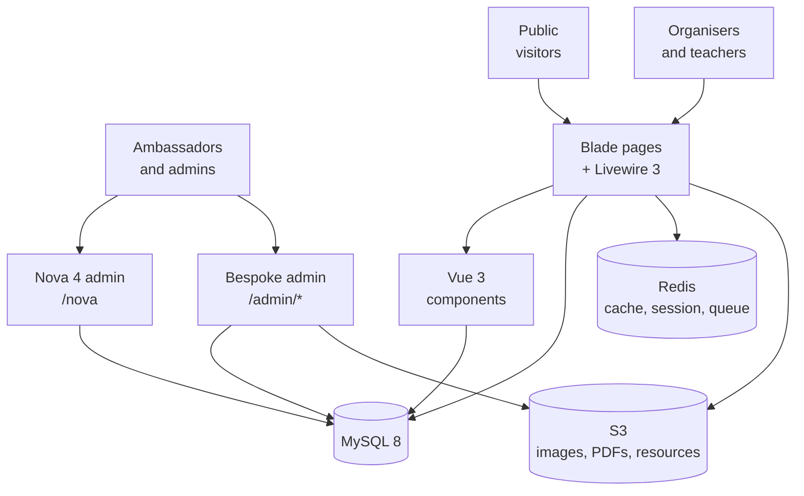
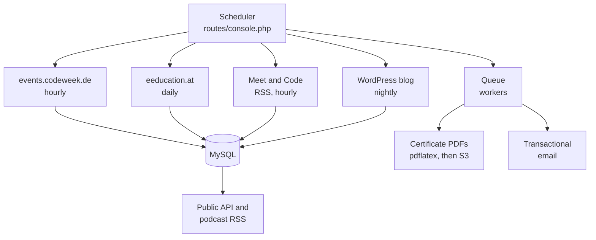

# 01 — Architecture

## The short version

Code Week is one Laravel monolith. There is no microservice layer, no separate API service, and no external search cluster. Almost everything you need to understand lives in `app/`, `routes/web.php`, and `resources/views/`.

The two things that sit outside the monolith are the **WordPress blog** (a separate application, synced in nightly over HTTP) and **S3** (file storage). Everything else is the Laravel app, its MySQL database, and Redis.

## Stack

| Layer | Technology | Notes |
|-------|------------|-------|
| Language | PHP 8.2+ | `composer.json` requires `^8.2`; CI runs 8.3 |
| Framework | Laravel 11 | Uses the Laravel 11 slim skeleton — see "Bootstrap" below |
| Admin | Laravel Nova 4 | Paid licence required to install. At `/nova` |
| Database | MySQL 8 | 173 migrations. SQLite is used for tests only |
| Cache / queue / session | Redis available, drivers set per environment | `predis` client. No Horizon |
| Server rendering | Blade | The bulk of the public site |
| Interactive server components | Livewire 3 | Tables, filters, signup forms |
| Client components | Vue 3 | Mounted as islands into Blade, not a single-page app |
| Asset build | Vite 5 | Entries in `vite.config.js` |
| Styling | Tailwind 3 **and** legacy SCSS | Both are live; see "Two styling systems" below |
| Object storage | S3 | Two buckets, two disks |
| PDF generation | `pdflatex` via TeX Live | Certificates. See [08](08-certificates.md) |
| Spreadsheets | `maatwebsite/excel` | All bulk import and export |
| Error monitoring | Sentry | Wired in `bootstrap/app.php` |
| Auth | Laravel UI + Socialite + Sanctum | Local accounts plus four social providers |
| Roles | `spatie/laravel-permission` | Nine roles. See [04](04-domain-model.md) |

## How the pieces fit

Two views, because the request path and the background work are largely independent.

**Serving a request.** Four user-facing surfaces, one database.



**Background work and integrations.** Everything below is driven by the scheduler in `routes/console.php` and executed by queue workers.



Browser-side third parties sit outside both diagrams: Mapbox and OpenStreetMap supply map tiles, ArcGIS does geocoding through a server-side proxy, and Sentry collects errors.

## Bootstrap and wiring

Laravel 11's slim skeleton means there is **no `app/Http/Kernel.php` and no `app/Console/Kernel.php`**. If you are used to older Laravel, this is the main orientation shock. Everything is in two files.

[bootstrap/app.php](../../bootstrap/app.php) registers routing, middleware, and exception handling:

```16:21:bootstrap/app.php
    ->withRouting(
        web: __DIR__.'/../routes/web.php',
        api: __DIR__.'/../routes/api.php',
        commands: __DIR__.'/../routes/console.php',
        // channels: __DIR__.'/../routes/channels.php',
        health: '/up',
```

Notable consequences:

- **The cron schedule lives in [routes/console.php](../../routes/console.php)**, not a kernel class. See [10](10-scheduled-jobs-and-runbooks.md).
- **There is a health endpoint at `/up`** provided by the framework. Useful for uptime monitoring.
- Four custom middleware run on every web request:

```31:36:bootstrap/app.php
        $middleware->web([
            \App\Http\Middleware\EnsureNovaMainDashboard::class,
            \App\Http\Middleware\CheckBrowser::class,
            \App\Http\Middleware\Locale::class,
            \App\Http\Middleware\CheckConsent::class
        ]);
```

`CheckConsent` is the one that will surprise you: any logged-in user without a recorded GDPR consent is redirected to `/consent` before they can use the site. `Locale` resolves the display language. `EnsureNovaMainDashboard` re-registers the Nova dashboard, a workaround for a Nova sidebar quirk.

Middleware aliases worth knowing:

| Alias | Class | Used for |
|-------|-------|----------|
| `role`, `permission` | spatie | Route-level role gating |
| `super.certificate.admin` | `EnsureSuperCertificateAdmin` | The certificate admin area. **Hardcoded to one email** — see [12](12-risks-and-known-issues.md) |
| `support.service.token` | `SupportServiceToken` | Bearer-token gate on the internal support API |

[bootstrap/providers.php](../../bootstrap/providers.php) registers five application providers: `AchievementsServiceProvider`, `AppServiceProvider`, `CalendarServiceProvider`, `NovaServiceProvider`, and `RouteServiceProvider`. Package providers for Intervention Image, GeoIP, the Vue i18n generator, Feeds, and the IDE helper are registered inline in `bootstrap/app.php`.

## Repository layout

### `app/` — the thing to understand first

**Models live at the top level of `app/`, not in `app/Models/`.** There are 60 PHP files directly in `app/`, most of them Eloquent models: `app/Event.php`, `app/User.php`, `app/Country.php`, `app/Excellence.php`, `app/Blog.php`, and so on. This is a legacy layout carried forward from early Laravel versions.

`app/Models/` exists too, but only holds newer additions: the navigation models (`MenuSection`, `MenuItem`) and the support copilot models under `app/Models/Support/`. So when looking for a model, check both places. See [04](04-domain-model.md) for the full inventory.

Everything else is conventional:

| Directory | Contents |
|-----------|----------|
| `app/Achievements/` | Badge and gamification definitions for leading teachers |
| `app/Certificates/` | Certificate support classes |
| `app/Console/Commands/` | ~150 Artisan commands. The largest and messiest directory in the repo |
| `app/Enums/` | Enum types, e.g. global search filters |
| `app/Exports/` | `maatwebsite/excel` export classes |
| `app/Filters/` | Query filter objects — `EventFilters` and `ResourceFilters` drive all search |
| `app/Helpers/` | Static helper classes, including `CertificatesHelper` and `Codeweek4AllHelper` |
| `app/Http/Controllers/` | Controllers, including the bespoke admin screens |
| `app/Http/Middleware/` | The custom middleware listed above |
| `app/Importers/` | Remote feed parsers (e.g. eeducation) |
| `app/Imports/` | Spreadsheet import classes, including the bulk activity uploader |
| `app/Jobs/` | Twelve queued jobs — certificates, bulk imports, user deletion |
| `app/Livewire/` | Livewire 3 components |
| `app/Nova/` | 47 Nova resources plus actions, filters, metrics, dashboards |
| `app/Policies/` | Authorisation policies. `EventPolicy` is the important one |
| `app/RSSItems/` | Staging models for the legacy German city feeds |
| `app/Services/` | The newer, better-organised business logic. Bulk upload, support copilot, workbook parsing |

The rough rule: **`app/Services/` is where recent work went, `app/Console/Commands/` is where historical work accumulated.** Code quality follows that split.

### Everything else

| Path | Contents |
|------|----------|
| `routes/web.php` | 892 lines. The public site, activity CRUD, admin screens, auth |
| `routes/api.php` | 53 lines. Public map/event endpoints and the internal support API |
| `routes/console.php` | 62 lines. The cron schedule |
| `config/` | 22 config files, several bespoke. See [03](03-configuration.md) |
| `database/migrations/` | 173 migrations |
| `database/seeders/` | Roles, taxonomies, CMS page content, dev fixtures |
| `database/factories/` | 31 factories for tests |
| `resources/views/` | Blade templates, including Livewire views and mail templates |
| `resources/js/` | Vue 3 components; `app.js` is the entry point |
| `resources/assets/sass/` | Legacy SCSS |
| `resources/css/app.css` | Tailwind entry point |
| `resources/lang/` | Translation files, one directory per locale |
| `resources/latex/` | Certificate templates. See [08](08-certificates.md) |
| `resources/excel/` | Source spreadsheets for the legacy CLI importers |
| `devspace/` + `devspace.yaml` | **Local development only.** See [02](02-environments-and-deployment.md) |
| `scripts/` | Python helpers for resource imports, plus WordPress theme patch scripts |
| `docs/ops/` | Existing operational runbooks |
| `docs/internal/` | Gitignored working files |
| `tests/` | ~102 test files |

## Two styling systems

Both Tailwind and a legacy SCSS bundle are compiled and shipped. [vite.config.js](../../vite.config.js) has three entry points:

```19:23:vite.config.js
            input: [
                'resources/assets/sass/app.scss',
                'resources/css/app.css',
                'resources/js/app.js',
            ],
```

`resources/css/app.css` is just the Tailwind directives. `resources/assets/sass/app.scss` is the older hand-written stylesheet that still carries much of the site's appearance. Newer pages lean on Tailwind, older ones on the SCSS. When changing styling, check which system the page you are editing actually uses before adding classes.

## Front end model

This is **not** a single-page application, and treating it like one will cause confusion.

- Most pages are Blade, server-rendered, with a full page load between navigations.
- Vue 3 is mounted into specific containers for the richer interfaces: the activity registration form, the map, the resource catalogue, the matchmaking tool.
- Livewire 3 handles server-driven interactivity such as filterable tables, without writing an API endpoint.
- The Vue components talk back to endpoints defined in `routes/web.php` under `/api/*` (not `routes/api.php`), which is a slightly unusual arrangement worth remembering when you go looking for an endpoint.

Because Blade, Livewire, and Vue coexist on some pages, there have been repeated bugs from mounting conflicts, where a Livewire component inside the Vue root stops working. If a filter or a calendar mysteriously stops responding, check whether it sits inside the Vue mount point.

## Search and geocoding

There is **no external search index.** Despite `SCOUT_DRIVER` and Algolia variables existing in the configuration, they are unused. All activity and resource search is plain MySQL through query filter objects:

- `app/Filters/EventFilters.php` — country, free text, theme, audience, activity type, year, tag, format, age, language, date. Format and age filters use MySQL `JSON_CONTAINS` against JSON columns; language uses `FIND_IN_SET`.
- `app/Filters/ResourceFilters.php` — the Learn & Teach catalogue, joining across pivot tables.

Map data uses the same filters, selects only the columns the map needs, groups by country, and is cached for 300 seconds.

**Geocoding is ArcGIS**, proxied through `GeocodeController` so the browser never calls it directly. Note that the WP5 architecture document states Nominatim; that is incorrect, the code calls the ArcGIS World GeocodeServer. Map *tiles* are Mapbox and OpenStreetMap behind Leaflet.

IP geolocation is a separate concern, handled by `torann/geoip`, and is only used to pick a sensible default country on the map page and during leading teacher signup.

## Where the data comes from

Activities reach the database three ways, and knowing which one produced a row is often the first step in debugging it:

| Source | Mechanism | Marker on the row |
|--------|-----------|-------------------|
| Organiser self-registration | The public activity form | `mass_added_for` is null |
| Admin bulk upload | Spreadsheet through `/admin/bulk-upload` | `mass_added_for = 'Excel'` |
| National partner feed | Scheduled Artisan commands | `mass_added_for` names the feed; `source_ref` holds the upstream ID |

See [06](06-bulk-uploads-and-imports.md) and [07](07-partner-feeds-and-apis.md).

## Certificates need a TeX installation

This catches everyone. Certificates are not generated with a PHP PDF library. They are generated by running `pdflatex` against `.tex` templates in `resources/latex/`, then uploading the resulting PDF to S3. A server without TeX Live installed will fail every certificate operation. The required packages are listed in [08](08-certificates.md).
