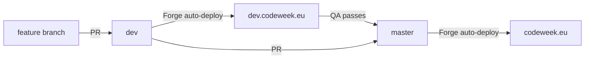

# 02 — Environments and deployment

## Read this first

The repository contains a `devspace.yaml` and a `devspace/` directory full of Kubernetes manifests, Helm chart references, and a Traefik ingress. It is very easy to conclude that Code Week runs on Kubernetes.

**It does not.** Production and staging both run on **Laravel Forge** over AWS EC2, with a conventional nginx + PHP-FPM setup and Forge's own deployment scripts. The DevSpace and Kubernetes tooling in this repo is **local development only** and is not used to serve any public environment.

Nothing about the production infrastructure is version controlled in this repository. The server `.env` files, the cron entry that runs the scheduler, the queue worker definitions, and the nginx configuration all live in Forge. Treat Forge as the source of truth, and export what you need during handover.

## Environments

| Environment | URL | Purpose |
|-------------|-----|---------|
| Local | `codeweek.local.europa.eu` (DevSpace) or a standard local PHP setup | Development |
| Dev / staging | [dev.codeweek.eu](https://dev.codeweek.eu/) | QA before anything reaches live. Every change goes through here |
| Live | [codeweek.eu](https://codeweek.eu) | Production |

Both hosted environments are Forge sites on separate EC2 instances, each with its own application directory under `/home/forge/`. The SSH addresses are held in the credentials vault and deliberately not written down here — see [00](00-access-checklist.md) section 9 for why.

Two things about dev are worth knowing before you use it:

- **Dev often points at the same `RESOURCES_BUCKET` as production.** Importing resources on dev will write PDFs into the production bucket, even though the database rows stay on dev. This is documented in [docs/ops/learn-and-teach-resource-import.md](../ops/learn-and-teach-resource-import.md) and is a real foot-gun.
- Dev has its own database, so data diverges from live over time. It is not a reliable place to reproduce data-specific bugs unless you refresh it first.

## Branch model and deploy flow



The process, as actually practised:

1. Branch off `dev` for the work.
2. Open a PR into `dev`.
3. Forge deploys `dev` to [dev.codeweek.eu](https://dev.codeweek.eu/).
4. QA on dev.
5. Open a PR from `dev` into `master`.
6. Forge deploys `master` to [codeweek.eu](https://codeweek.eu).

### Branch naming is inconsistent, and it matters

The repository has accumulated a large number of long-lived branches, many named after a date or an import batch (`bulk_11_11_25`, `2-sept-imports`, `coderdojo-import-april`, `30-june-25-imports`). These were working branches for one-off data jobs and are mostly abandoned. Do not assume an unfamiliar branch is active.

More importantly, the production branch is referred to inconsistently across the project. CI triggers on `master` and `dev`:

```3:7:.github/workflows/laravel.yml
on:
  push:
    branches: [ master, dev ]
  pull_request:
    branches: [ master, dev ]
```

while [docs/ops/learn-and-teach-resource-import.md](../ops/learn-and-teach-resource-import.md) describes the final step as a "PR → `main` / `master`". **Confirm in Forge which branch each site actually deploys from** before your first release, and consider standardising the naming.

## Continuous integration

One GitHub Actions workflow: [.github/workflows/laravel.yml](../../.github/workflows/laravel.yml). It runs on pushes and pull requests against `master`.

| Step | Detail |
|------|--------|
| PHP | 8.3 with Composer v2 |
| Node | 21 |
| Env | Copies `.env.example` to `.env` |
| Dependencies | **Overwrites `composer.json` with [composer-test.json](../../composer-test.json)** |
| Nova auth | `secrets.NOVA_USERNAME` and `secrets.NOVA_PASSWORD` |
| Database | A SQLite file at `database/database.sqlite` |
| Assets | `npm install && npm run build` |
| Tests | `php artisan test --parallel` with `DB_CONNECTION=sqlite` |

The `composer-test.json` swap is the part to remember. It exists to strip the Nova-only packages so CI does not need the full paid dependency tree. The consequence is that **CI does not exercise any Nova code**. Nova resources, actions, and filters are only ever tested by a human clicking through the admin. If you change Nova, QA it on dev manually.

CI triggers on pushes and pull requests for both `master` and `dev`. It previously only ran for `master`, so pull requests into `dev` ran no tests at all.

The suite is green. It was not when this handover started — two tests failed and five files were silently skipped — so if you see red, it is something you changed rather than inherited noise. Keep it that way: a suite that is normally red is a suite nobody reads. [11](11-testing-and-local-dev.md)

An abandoned Travis configuration targeting PHP 7.3 has been removed, along with `.env.travis`. GitHub Actions is the only pipeline.

## Deploying

Forge handles deployment on push. The sequence it runs is essentially the script documented in the original infrastructure handover:

```bash
cd /home/forge/<site-directory>

git pull origin $BRANCH

composer install --no-interaction --prefer-dist --optimize-autoloader

npm install
npm run build

php artisan migrate --force

php artisan nova:publish
php artisan view:clear
php artisan cache:clear
php artisan config:clear
php artisan queue:restart
```

Points that matter:

- **`php artisan queue:restart` is essential, not optional.** Queue workers hold the old code in memory. Certificates in particular will keep using last year's LaTeX templates until workers restart. See [08](08-certificates.md).
- `php artisan nova:publish` republishes Nova's assets and must run after a Nova version change.
- `migrate --force` runs migrations non-interactively. With 173 migrations and a large `events` table, some migrations are slow. Check what a release contains before deploying during October.
- `npm run build` runs on the server, so Node must be installed and the instance needs enough memory. PHP memory limit should be at least 2048 MB per the original setup notes.

## Server requirements

From the original infrastructure handover, still accurate:

| Requirement | Value |
|-------------|-------|
| PHP | 8.2+ (the original doc says 8.3; `composer.json` requires `^8.2`) |
| Composer | v2 |
| Node.js | 20+ (CI uses 21) |
| PHP memory limit | 2048 MB |
| MySQL | 8 |
| Nova credentials | In `auth.json` |
| TeX Live | Required for certificates |

TeX Live packages needed for certificate generation:

```bash
sudo apt-get install texlive-latex-base -y
sudo apt-get install texlive-fonts-recommended -y
sudo apt-get install texlive-fonts-extra -y
sudo apt-get install texlive-lang-cyrillic -y
sudo apt-get install texlive-lang-greek -y
sudo apt-get install texlive-latex-extra -y
sudo apt-get install texlive-font-utils -y
```

The Cyrillic and Greek language packages are not optional — certificates are issued in Greek, Ukrainian, and other non-Latin scripts, and those templates will fail to compile without them.

## Things Forge owns that the repo does not

Check and document each of these in Forge during handover, because losing them means losing functionality silently:

| Item | Why it matters |
|------|----------------|
| The `schedule:run` cron entry | Without it, none of the ~18 scheduled commands run: no partner imports, no blog sync, no reminder emails. See [10](10-scheduled-jobs-and-runbooks.md) |
| Queue worker(s) | Certificates and all queued mail stop without a worker. There is no Horizon and no supervisor config in the repo |
| The server `.env` | The only complete record of production configuration. `.env.example` is significantly incomplete — see [03](03-configuration.md) |
| SSL certificates | Managed by Forge |
| Deploy script contents | May have drifted from the script above |
| Daily database backups | Confirm these exist, and restore one to prove it |

## Local development with DevSpace

This is the optional Kubernetes-based local setup. It is genuinely useful because it avoids installing PHP, MySQL, Redis, and Node locally, but it is not required — a standard local PHP environment works too.

Prerequisites: Rancher Desktop (or Docker Desktop plus k3d), `kubectl`, and the DevSpace CLI.

What [devspace.yaml](../../devspace.yaml) deploys into the `codeweek` namespace:

| Deployment | Detail |
|------------|--------|
| `laravel-app` | `nginx:alpine` sidecar plus a PHP-FPM container, sharing an `emptyDir` at `/assets` |
| `mysql` | Bitnami MySQL chart 9.4.5, image tag 8.0.31 |
| `redis` | Bitnami Redis chart 17.4.0, image tag 6.0.12 |
| `nginx-config` | ConfigMap for nginx |
| `codeweek-config` | Traefik `IngressRoute` and security middleware |

Setup, per [devspace/README.md](../../devspace/README.md):

```bash
kubectl create ns codeweek

# self-signed cert for the local .europa.eu hostname
kubectl create secret generic certificates-secret \
  --from-file=tls.crt=./localhost.crt --from-file=tls.key=./localhost.key

# add to /etc/hosts
# 127.0.0.1  codeweek.local.europa.eu

cp devspace/.env.devspace .env
devspace dev          # prompts for a GitHub token and Nova credentials
devspace run artisan migrate:fresh --seed
```

Then open `https://codeweek.local.europa.eu`.

Convenience wrappers defined in `devspace.yaml`:

```bash
devspace run artisan <command>
devspace run composer <command>
devspace run npm <command>
devspace run mysql
devspace run generate-key
```

MySQL is port-forwarded to `localhost:3308`.

### Known problem with the DevSpace setup

The PHP image is pinned to PHP 8.0:

```3:5:devspace.yaml
vars:
  - name: APP_IMAGE
    value: public.ecr.aws/cnect-prime/php-8.0-fpm:latest
```

The application requires PHP 8.2 or newer. This image predates the Laravel 11 upgrade and will not satisfy `composer install`. Expect to have to point `APP_IMAGE` at a PHP 8.2+ FPM image before the DevSpace path works. This is tracked in [12](12-risks-and-known-issues.md).
