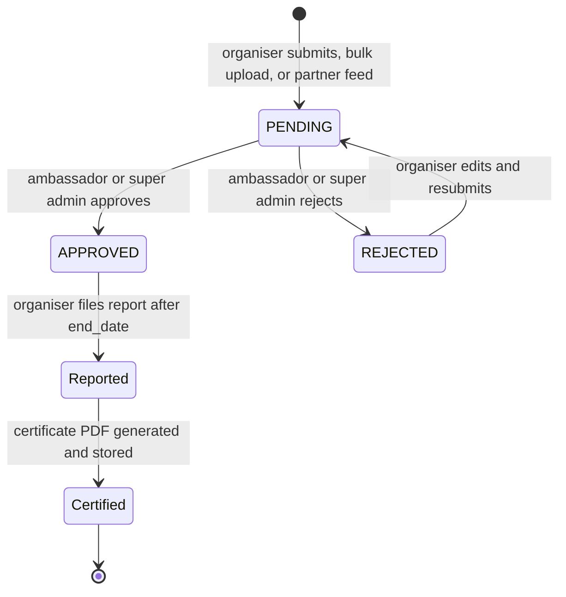

# 04 — Domain model

## What the platform is, in domain terms

Organisers register **activities** (called "events" in the code and database). Ambassadors, who are scoped to a country, **moderate** them. Approved activities appear on the public map and in search. After an activity finishes, the organiser files a **report**, which triggers a **certificate**. Separately, users can generate certificates for their participants, and the most prolific organisers and networks receive recognition certificates each year.

Alongside that sits a substantial CMS: the Learn & Teach resource catalogue, podcasts, training pages, the Grassroots Grants programme, and a large number of editorially managed landing pages, all administered through Nova.

## Terminology mismatch to internalise

| Public / stakeholder term | Code and database term |
|---------------------------|------------------------|
| Activity | `Event`, `events` table |
| Edition | A calendar **year**. There is no `Edition` model |
| Code Week 4 All | The `codeweek_for_all_participation_code` column on `events` |
| Hub | Two unrelated meanings — see below |

**"Edition" is not a model.** It is just a year. `excellences.edition` is an integer year, and activity year filtering is done on `end_date`. Commands take it as an argument, for example `php artisan notify:winners 2026`. Do not go looking for an editions table.

**"Hub" is ambiguous.** `GrassrootsGrantsHub` is a CMS record for the Grassroots Grants programme. It has nothing to do with the national or regional Code Week hubs that stakeholders talk about; those are not modelled as a separate entity.

## Where models live

Most models are at the **top level of `app/`**, not `app/Models/`. There are 60 PHP files directly in `app/`, the majority of them Eloquent models. `app/Models/` holds only the newer additions:

| Location | Contents |
|----------|----------|
| `app/*.php` | `Event`, `User`, `Country`, `City`, `Audience`, `Theme`, `Tag`, `Excellence`, `Participation`, `Moderation`, `Location`, `Volunteer`, `School`, `Experience`, `Blog`, `Podcast*`, `ResourceItem` and its taxonomies, `Importer`, `MeetAndCodeRSSItem`, all the CMS page models |
| `app/Models/` | `MenuSection`, `MenuItem` |
| `app/Models/Support/` | `SupportCase`, `SupportCaseMessage`, `SupportCaseAction`, `SupportApproval`, `SupportGmailCursor` |

Check both locations when hunting for a model. Because `App\User` is not in `app/Models/`, the environment must set `AUTH_MODEL=App\User` — see [03](03-configuration.md).

Note also that three classes in `app/` are **not** models despite sitting alongside them: `Certificate.php`, `CertificateExcellence.php`, and `CertificateParticipation.php` are service classes that drive PDF generation. See [08](08-certificates.md).

## The activity lifecycle



Statuses are the strings `PENDING`, `APPROVED`, and `REJECTED` on `events.status`.

Key behaviour on the model, in [app/Event.php](../../app/Event.php):

| Method | Effect |
|--------|--------|
| `approve()` | Sets status to `APPROVED` and emails the organiser |
| `reject()` | Sets status to `REJECTED` and writes a `Moderation` record capturing the reason |
| `notifyAmbassadors()` | Emails the ambassadors for the activity's country when a new activity needs review |
| `promote()` | Marks an online activity for promotion in the online calendar |
| `feature()` | Marks an activity as featured |
| `relocate()` | Repairs missing or nonsense coordinates |
| `createLocation()` | Saves the venue as a reusable `Location` for that organiser |

Important asymmetry: **rejection records a reason, approval does not.** And the Nova reject action has no message field, so rejecting through Nova writes an empty reason. The Blade moderation screens at `/pending` and `/review` do capture it. See [05](05-nova-admin.md).

Two policy behaviours that generate support tickets:

- `EventPolicy::edit()` returns false once `reported_at` is set. Organisers **lose the ability to edit after reporting**, with no explanatory message. This is by design (the report feeds the certificate) but users find it baffling.
- `EventPolicy::feature()` always returns false, so featuring only works via the super-admin bypass in the policy's `before()` hook.

## `events` — the central table

Defined in `database/migrations/2017_05_19_094208_create_events_table.php` and extended by dozens of later migrations. Soft-deleted.

### Content and identity

| Column | Notes |
|--------|-------|
| `title`, `slug` | Slug is generated from the title and used in the public URL |
| `description` | Sanitised on read via `stevebauman/purify` |
| `organizer` | Free-text organisation name |
| `organizer_type` | School, library, private business, non-profit, other |
| `activity_type` | `open-online`, `invite-online`, `invite-in-person`, `open-in-person`, `other` |
| `event_url` | The organiser's own link. Mandatory for open-online activities |
| `contact_person`, `user_email` | Contact details |
| `picture`, `picture_detail` | S3 paths |
| `language` | Comma-separated language codes. Filtered with `FIND_IN_SET` |

### Scheduling

| Column | Notes |
|--------|-------|
| `start_date`, `end_date` | `end_date` is what year filtering uses |
| `pub_date`, `created`, `updated` | Legacy timestamp columns, separate from Laravel's own |
| `recurring_event` | `daily`, `weekly`, or `monthly` |
| `recurring_type` | `consecutive` or `individual` |
| `duration` | `0-1`, `1-2`, `2-4`, `over-4` |

### Geography

| Column | Notes |
|--------|-------|
| `location` | Free-text address |
| `latitude`, `longitude`, `geoposition` | `geoposition` is the combined value the map reads |
| `country_iso` | Two-letter code, foreign key to `countries.iso` |
| `location_id` | Optional link to a saved `Location` |

### Ownership and moderation

| Column | Notes |
|--------|-------|
| `creator_id` | The owning user |
| `approved_by` | Who approved it |
| `status` | `PENDING` / `APPROVED` / `REJECTED` |

### Reporting and certificates

| Column | Notes |
|--------|-------|
| `reported_at` | Set when the organiser files the report. Locks editing |
| `participants_count`, `males_count`, `females_count`, `other_count` | Attendance breakdown |
| `average_participant_age`, `percentage_of_females` | Legacy report fields |
| `name_for_certificate` | The name printed on the certificate |
| `certificate_url`, `certificate_generated_at` | The generated PDF |
| `report_notifications_count`, `last_report_notification_sent_at` | Reminder throttling |

Certificates of Recognition have **no separate table** — their data lives on `events`.

### Code Week 4 All

| Column | Notes |
|--------|-------|
| `codeweek_for_all_participation_code` | The `cw20-xxxx` style code linking activities into a network |

Aggregation logic is in `app/Helpers/Codeweek4AllHelper.php` and `Codeweek4AllController`. This is what drives Certificates of Excellence: a network qualifies at 10 linked activities from 10 different organisers, or 3 countries involved.

### Newer structured fields (2025 form revision)

| Column | Notes |
|--------|-------|
| `activity_format` | **JSON array.** Filtered with `JSON_CONTAINS` |
| `ages` | **JSON array.** Filtered with `JSON_CONTAINS` |
| `is_extracurricular_event`, `is_standard_school_curriculum`, `is_use_resource` | Booleans |

Permitted values are class constants on the model:

```87:98:app/Event.php
    public const ACTIVITY_FORMATS = [
        'coding-camp',
        'summer-camp',
        'weekend-course',
        'evening-course',
        'careerday',
        'university-visit',
        'coding-home',
        'code-week-challenge',
        'competition',
        'other',
    ];
```

`AGES` is `under-5`, `6-9`, `10-12`, `13-15`, `16-18`, `19-25`, `over-25`. `DURATIONS` is `0-1`, `1-2`, `2-4`, `over-4`.

These constants are the **single source of truth**, and the bulk uploader and partner importers validate against them. If you add a value, update the constant, the front-end form, the translation files, and the public wiki page that partners work from.

### Import provenance

| Column | Notes |
|--------|-------|
| `mass_added_for` | Which mechanism created the row: `Excel`, `API codeweek_de`, `RSS Eeducation`, etc. Null for self-registered activities |
| `source_ref` | Upstream identifier, namespaced as `{feed}:{uid}` |
| `source_synced_at` | Last time the feed touched the row |

`source_ref` is the deduplication key for feed imports and the reason a re-run does not duplicate rows. The namespacing matters: `codeweek-de:{uid}` from the central German export deliberately does not collide with legacy `berlin:{uid}` rows. See [07](07-partner-feeds-and-apis.md).

### Online activity promotion

| Column | Notes |
|--------|-------|
| `highlighted_status`, `playback_url` | Featured online activities and recordings |
| `leading_teacher_tag` | Links an activity to a leading teacher's `tag` |

### Relationships

| Relationship | Target |
|--------------|--------|
| `owner()` | `User` via `creator_id` |
| `country()` | `Country` via `country_iso` |
| `audiences()` | `Audience`, pivot `audience_event` |
| `themes()` | `Theme`, pivot `event_theme` |
| `tags()` | `Tag`, pivot `event_tag` |
| `leadingTeacher()` | `User`, matched on `leading_teacher_tag` = `users.tag` |
| `moderations()` | `Moderation` |
| `extractedLocation()` | `Location` |
| `notification()` | `Notification` |

Note `leadingTeacher()` joins on a **string tag**, not a foreign key. A typo in a tag silently breaks the link rather than erroring.

## `users`

Soft-deleted, implements `MustVerifyEmail`, uses spatie's `HasRoles`.

| Column group | Columns |
|--------------|---------|
| Identity | `firstname`, `lastname`, `username`, `email`, `password` |
| Geography | `country_iso`, `city_id` |
| Social login | `provider`, `provider_id`, `avatar_path` |
| Preferences | `privacy`, `email_display`, `receive_emails` |
| GDPR | `consent_given_at`, `future_consent_given_at` |
| Verification | `email_verified_at`, `pending_email` |
| Leading teacher | `tag` |
| Admin tooling | `current_country`, `approved`, `magic_key` |

Notes:

- There is **no `name` column** — it is `firstname` and `lastname`. The Nova `User` resource searches a non-existent `name` column, so that search is broken. See [12](12-risks-and-known-issues.md).
- `current_country` lets a super admin view the site as though they were in a given country.
- `magic_key` powers tokenised unsubscribe and notification links, regenerated hourly by `php artisan magic:key`.
- `approved` is a legacy boolean that coexists with spatie roles. Roles are the real source of truth; treat `approved` with suspicion.
- **`$guarded = []` on the User model**, so every attribute is mass-assignable. Be careful with `fill()` and `update()` on user-supplied input.

### Key relationships

`events()`, `country()`, `excellences()` and `superOrganisers()` (both `Excellence`, filtered by `type`), `participations()`, `schools()`, `locations()`, `experience()`, `actions()`, `expertises()`, `levels()`, `subjects()`, and `taggedActivities()`.

## Roles and permissions

Managed by `spatie/laravel-permission`. Seeded across four seeders. This section covers what the roles *are*; [14](14-accounts-and-moderation.md) covers how somebody gets one and what each role can actually do.

From [database/seeders/RolesAndPermissionsSeeder.php](../../database/seeders/RolesAndPermissionsSeeder.php):

| Role | Permissions |
|------|-------------|
| `member` | create event, create school |
| `event owner` | update event, generate certificate |
| `ambassador` | moderate event |
| `school manager` | update school, generate certificate |
| `resource editor` | moderate resource |
| `super admin` | all permissions |

Added by the other seeders:

| Role | Source | Permissions |
|------|--------|-------------|
| `leading teacher` | `LeadingTeacherRoleSeeder` | submit resource |
| `leading teacher admin` | `LeadingTeacherRoleSeeder` | manage the leading teacher list |
| `activities admin` | `ActivitiesAdministratorRoleSeeder` | feature event |

Full permission list: `create event`, `update event`, `moderate event`, `create school`, `update school`, `generate certificate`, `view activities`, `moderate resource`, `submit resource`, `feature event`.

**Do not rely on role IDs.** Two places in the Nova layer hardcode numeric role IDs, which only hold if the seeders ran in their original order. Use role *names*. See [12](12-risks-and-known-issues.md).

## Ambassadors

An ambassador is a user with the `ambassador` role and a `country_iso`. They moderate activities for their own country and nothing else — the scoping is applied in `EventPolicy` and in the Nova `Event` resource's `indexQuery`.

There are two routes to becoming one, which is itself a wrinkle:

1. **The volunteer pipeline.** A user applies, creating a `Volunteer` record. A super admin approves it at `/volunteer/{id}/approve`, which assigns the role.
2. **Directly in Nova.** The `Ambassador` resource exposes a boolean, and `User::setAmbassadorAttribute()` assigns or removes the role when it is toggled.

## Taxonomies

| Model | Table | Notes |
|-------|-------|-------|
| `Audience` | `audiences` | Target group. Nine values |
| `Theme` | `themes` | Topic. Has an `order` column for display sequence |
| `Tag` | `tags` | Free-form, slug-based |

The numeric IDs matter because partners submit them directly in bulk upload spreadsheets. The authoritative public list is on the [wiki](https://github.com/codeeu/codeweek/wiki/Publish-your-events-into-Codeweek), and it must be kept in step with the database.

Theme IDs are **not contiguous** — the published list skips 7, 10, 12, and 15. That is the residue of a theme consolidation done with `php artisan themes:sync-finalized`, which replaced the master list and remapped `event_theme`. Do not renumber themes casually; historical activities point at these IDs and partner spreadsheets hardcode them.

## Learn & Teach resources

| Model | Purpose |
|-------|---------|
| `ResourceItem` | A resource — a PDF or an external link |
| `ResourceCategory`, `ResourceType`, `ResourceSubject`, `ResourceLevel`, `ResourceLanguage`, `ResourceProgrammingLanguage` | Filter taxonomies, each with its own `resourceitem_*` pivot |

Files go to the `resources` S3 disk. A resource's `source` is either an S3 PDF URL or an external `https://` link, and the front-end card behaves differently for each. Import is covered in [06](06-bulk-uploads-and-imports.md) and the existing runbook at [docs/ops/learn-and-teach-resource-import.md](../ops/learn-and-teach-resource-import.md).

## Certificates and recognition

Four certificate types, three storage locations. Full detail in [08](08-certificates.md).

| Type | Data lives in | Awarded to |
|------|---------------|------------|
| Recognition | Columns on `events` | An organiser after reporting an approved activity |
| Participation | `participations` table | Attendees, generated in bulk by the organiser |
| Excellence | `excellences` table, `type = 'Excellence'` | Code Week 4 All networks meeting the threshold |
| Super Organiser | `excellences` table, `type = 'SuperOrganiser'` | Organisers running 10+ activities in an edition |

`excellences` has a unique constraint on `(user_id, edition, type)`, which is what stops duplicate awards. It also carries `notified_at`, `certificate_url`, `name_for_certificate`, and error columns added in 2025 (`certificate_generation_error`, `certificate_sent_error`) for diagnosing failed runs.

`participations` stores `names` (the whole list for one batch), `event_name`, `event_date`, `participation_url` for the generated ZIP, and a `status` that starts at `PENDING`.

## Leading teachers and gamification

Leading teachers are users with the `leading teacher` role and a `tag`. Activities carrying that tag in `leading_teacher_tag` are credited to them, linked up by `php artisan link:lt`.

| Model | Purpose |
|-------|---------|
| `Experience` | Points per user per year |
| `LeadingTeacherAction` | Logged actions that earn points |
| `LeadingTeacherExpertise` | Expertise areas on the profile |

Badge definitions live in `app/Achievements/`, registered by `AchievementsServiceProvider`.

## GDPR, consent, and deletion

This area is unusually consequential, so read it before touching user records.

**Consent is enforced by middleware.** `CheckConsent` runs on every web request. A logged-in user with a null `consent_given_at` is redirected to `/consent` and cannot use the site until they answer. Declining logs them out.

Two consent fields exist because two separate data transfers had to be consented to: the Code4Europe transfer, and a later prospective transfer to the Commission and HaDEA. `giveConsent()` and `giveFutureConsent()` record them.

**Deletion reassigns rather than cascades.** `php artisan users:delete-without-consent` and the accompanying [soft_delete_users_without_consent.sql](../../soft_delete_users_without_consent.sql) reparent a departing user's records to a magic legacy user with id `1000000` (`legacy@codeweek.eu`), then soft-delete the user. This preserves historical activity counts.

Cautions:

- The SQL script performs both soft deletes and hard deletes in one pass and is **not reversible without a database backup**. Take one first, every time.
- The literal `1000000` appears in several places in the codebase. It is load-bearing.
- Soft deletes are in play on `users`, `events`, `locations`, and `importers`. A "missing" record is often just soft-deleted; query with `withTrashed()` before concluding data loss.

## Moderation audit

`Moderation` rows (`moderations` table) hold `event_id`, `status`, `message`, and `status_by`. They are written on rejection and are the only record of why something was turned down.

## Geography

| Model | Notes |
|-------|-------|
| `Country` | **Primary key is `iso`**, not an auto-increment id. Carries centroid latitude and longitude, plus Facebook and website links |
| `City` | Reference data for user profiles |
| `Location` | Saved venues belonging to an organiser. Soft-deleted |

Because `Country` is keyed on `iso`, relationships use the ISO string throughout. Country centroids are used by `relocate:country` to give activities with missing coordinates a plausible position rather than dropping them at the origin.

## Database at a glance

173 migrations. Other tables worth knowing:

| Table | Purpose |
|-------|---------|
| `importers` | Tracks feed-imported activities so `clean:remote` can remove ones that vanish upstream |
| `*_rss_items` | Per-city staging tables for the legacy German feeds |
| `support_cases`, `support_approvals`, and siblings | The support copilot subsystem |
| `menu_sections`, `menu_items` | Editable site navigation |
| `activity_log` | `spatie/laravel-activitylog`, currently only used by `School` |
| `experiences`, `user_achievements`, `leading_teacher_actions` | Gamification |
| `blogs` | Mirror of the WordPress blog. See [09](09-wordpress-blog.md) |

### Seeders and factories

`DatabaseSeeder` orchestrates countries, cities, roles, users, taxonomies, activities, resources, CMS pages, and schools. `UserSeeder` creates a super admin plus 60 ambassadors for development. There are 31 factories in `database/factories/`, including `EventFactory`, `ExcellenceFactory`, `ParticipationFactory`, and `ModerationFactory`.

`php artisan migrate:fresh --seed` gives a usable development dataset. Never run it against a real database.
