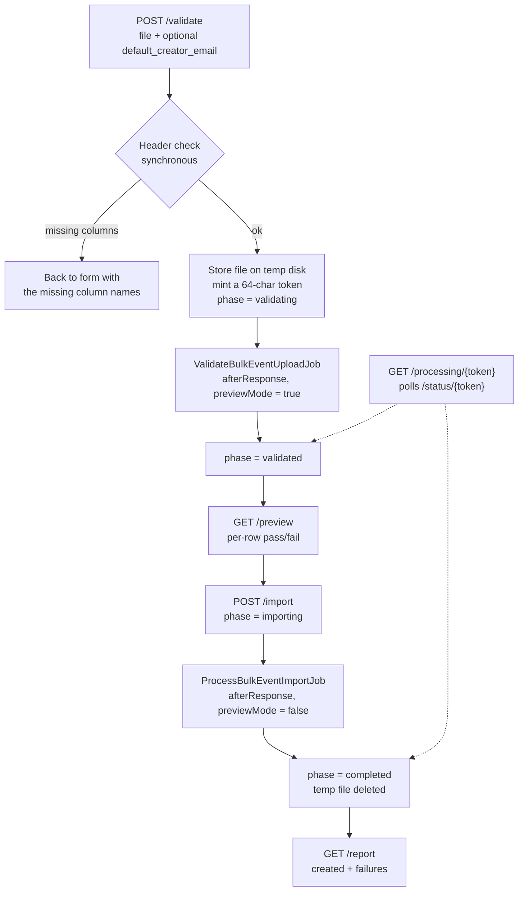

# 06 — Bulk uploads and imports

Three separate bulk tools exist, all super-admin only, all built on `maatwebsite/excel`:

| Tool | Route | Purpose |
|------|-------|---------|
| Bulk activity upload | `/admin/bulk-upload` | Import activities from a spreadsheet |
| Bulk user changes | `/admin/bulk-user-changes` | Apply role, email, and country changes to existing users |
| Resource import | `/admin/resources-import` | Publish Learn & Teach resources |

Activities that arrive automatically from national partner feeds are a different mechanism — see [07](07-partner-feeds-and-apis.md).

---

## Bulk activity upload

This is the tool national partners' data ends up going through, and the one you will use most. It is the modern, well-structured part of the import codebase.

### Components

| Piece | File |
|-------|------|
| Controller | [app/Http/Controllers/BulkEventUploadController.php](../../app/Http/Controllers/BulkEventUploadController.php) |
| Header validator | [app/Services/BulkEventUploadValidator.php](../../app/Services/BulkEventUploadValidator.php) |
| Row importer | [app/Imports/GenericEventsImport.php](../../app/Imports/GenericEventsImport.php) |
| State store | [app/Services/BulkEventUploadCache.php](../../app/Services/BulkEventUploadCache.php) |
| Duplicate matcher | [app/Services/BulkEventDuplicateFinder.php](../../app/Services/BulkEventDuplicateFinder.php) |
| Result accumulator | `app/Services/BulkEventImportResult.php` |
| Jobs | `app/Jobs/ValidateBulkEventUploadJob.php`, `app/Jobs/ProcessBulkEventImportJob.php` |
| Views | `resources/views/admin/bulk-upload/{index,processing,preview,report}.blade.php` |

### Routes

All behind `auth` and `role:super admin` in [routes/web.php](../../routes/web.php) lines 80-87.

| Method | Path | Name |
|--------|------|------|
| GET | `/admin/bulk-upload` | `admin.bulk-upload.index` |
| POST | `/admin/bulk-upload/validate` | `admin.bulk-upload.validate` |
| GET | `/admin/bulk-upload/processing/{token}` | `admin.bulk-upload.processing` |
| GET | `/admin/bulk-upload/status/{token}` | `admin.bulk-upload.status` |
| GET | `/admin/bulk-upload/preview` | `admin.bulk-upload.preview` |
| POST | `/admin/bulk-upload/import` | `admin.bulk-upload.import` |
| GET | `/admin/bulk-upload/report` | `admin.bulk-upload.report` |

### The flow



The key design point: **the file is parsed twice.** The first pass runs in preview mode, which validates every row and records pass or fail without writing anything. The second pass does the same validation and then persists. This means the preview is trustworthy — it is the real importer, not a separate validation routine that could drift.

State lives in the cache under `bulk_upload_{token}` with a **two-hour TTL**. Phases are `validating`, `validated`, `importing`, `completed`, `failed`. The processing page polls the `status` endpoint and redirects when the phase changes.

### Upload constraints

| Constraint | Value |
|------------|-------|
| Formats | `.csv`, `.xlsx`, `.xls` |
| Max size | 50 MB (`max:51200`) |
| Temp disk | `config('filesystems.bulk_upload_temp_disk')`, default `local` |
| Temp path | `temp/bulk_events_{timestamp}.{ext}` |
| Validation job timeout | 1800 seconds |
| Import job timeout | 3600 seconds |
| Retries | `tries = 1` on both. **A failed import does not retry** |

Both jobs are dispatched with `->afterResponse()`, so they start after the HTTP response is sent. They still need a **queue worker** unless the queue connection is `sync`. If uploads appear to hang on the processing page forever, check the worker first.

Row counts above **500** switch the preview to failures-only, to keep the page renderable. That threshold is `BulkEventUploadCache::PREVIEW_FAILURES_ONLY_THRESHOLD`. The public guide states a maximum of 10,000 rows per sheet.

### Required columns

Validated up front against `BulkEventUploadValidator::REQUIRED_COLUMNS`. A missing header aborts before any row is read, and the error message names exactly which ones are absent.

```14:32:app/Services/BulkEventUploadValidator.php
    public const REQUIRED_COLUMNS = [
        'activity_title',
        'name_of_organisation',
        'type_of_organisation',
        'activity_type',
        'description',
        'address',
        'country',
        'start_date',
        'end_date',
        'longitude',
        'latitude',
        'contact_email',
        'organiser_website',
        'participants_count',
        'males_count',
        'females_count',
        'other_count',
    ];
```

Note the distinction between **required headers** and **required values**. All 17 headers must be present. Only a subset must be non-empty per row: `activity_title`, `name_of_organisation`, `description`, `type_of_organisation`, `activity_type`, `country`, `start_date`, `end_date`. So `address` may be blank for an online activity even though the column must exist.

### Column to database mapping

| Spreadsheet column | `events` column | Transformation |
|--------------------|-----------------|----------------|
| `activity_title` | `title` and `slug` | Slug via `Str::slug()` |
| `name_of_organisation` | `organizer` | Trimmed |
| `type_of_organisation` | `organizer_type` | Trimmed |
| `activity_type` | `activity_type` | Trimmed |
| `description` | `description` | Trimmed |
| `address` | `location` | Trimmed |
| `country` | `country_iso` | Uppercased |
| `start_date`, `end_date` | `start_date`, `end_date` | Excel serial numbers or parseable strings |
| `longitude`, `latitude` | `longitude`, `latitude`, `geoposition` | Range-checked; `geoposition` becomes `"lat,lon"` |
| `contact_email` | `user_email`, and `contact_person` | Also drives creator resolution |
| `organiser_website` | `event_url` | Trimmed |
| `participants_count` | `participants_count` | Cast to int |
| `males_count`, `females_count`, `other_count` | same | Cast to int |

Optional columns:

| Spreadsheet column | `events` column | Notes |
|--------------------|-----------------|-------|
| `creator_id` | `creator_id` | Numeric ID or an email address |
| `image_path` | `picture` | Relative paths get a hardcoded S3 base URL prefixed |
| `language` | `language` | Takes the part before any `_`, lowercased. Defaults to `en` |
| `audience_comma_separated_ids` | `audience_event` pivot | Numeric IDs, 1-100, deduplicated |
| `theme_comma_separated_ids` | `event_theme` pivot | Passed through theme ID remapping |
| `tags` | `event_tag` pivot | Comma-separated names |
| `activity_format` | `activity_format` | Comma-separated, validated against `Event::ACTIVITY_FORMATS`, stored as JSON |
| `ages` | `ages` | Comma-separated, validated against `Event::AGES`, stored as JSON |
| `duration` | `duration` | Single value from `Event::DURATIONS` |
| `recurring_event` | `recurring_event` | Boolean-ish |
| `recurring_type` | `recurring_type` | From `Event::RECURRING_TYPES` |
| `is_extracurricular_event`, `is_standard_school_curriculum`, `is_use_resource` | same | TRUE / FALSE |
| `leading_teacher_tag` | `leading_teacher_tag` | Must match an existing user's `tag` exactly |
| `codeweek_for_all_participation_code` | `codeweek_for_all_participation_code` | Code Week 4 All code |

Values set by the importer regardless of the spreadsheet:

| Column | Value | Why it matters |
|--------|-------|----------------|
| `status` | `APPROVED` | **Bulk-uploaded activities skip moderation entirely** |
| `mass_added_for` | `Excel` | How you identify bulk-uploaded rows later |
| `pub_date`, `created`, `updated` | `now()` | |

That auto-approval is deliberate — an admin uploading a partner's vetted data does not want 3,000 rows in the moderation queue — but it means **a bad upload publishes immediately**. Always use the preview.

### Creator resolution

Every activity needs an owning user. `resolveCreatorId()` tries, in order:

1. The row's `creator_id`, if it is an integer.
2. The row's `creator_id`, if it is an email that matches an existing user.
3. The form's `default_creator_email`, if it matches an existing user.
4. The row's `contact_email`: exact match, then a match on the local part before the `@`, and finally **creating a new user** via `UserHelper::createUser()`.

Two consequences to be aware of. First, **a bulk upload can create user accounts as a side effect.** Second, the local-part fallback is fuzzy: a `contact_email` of `jane@school-a.be` can match an existing `jane@anything-else.com`, attributing the activity to the wrong person. That fallback exists because partner spreadsheets often carry slightly different addresses for the same person, but it is a real source of misattribution. If ownership looks wrong after an import, this is why.

### Duplicate handling

Re-running the same file **updates rather than duplicates**, provided the match succeeds. `BulkEventDuplicateFinder` matches on `title` + `start_date` + `country_iso` + `organizer`, and then additionally on either the same `location` string or coordinates within a small epsilon.

On a match the existing row's attributes are overwritten, and the audience and theme pivots are **detached and re-attached** so they reflect the new file exactly.

The corollary: change any one of title, start date, country, or organiser in the spreadsheet and the match fails, producing a second activity rather than an update. When a partner sends a corrected file, expect duplicates if they also cleaned up titles.

### Reading the report

The report screen lists created or updated rows plus failures. Failure messages name the row number and the offending column, for example:

```
Row 42 — missing required columns: country, start_date
Row 87 — columns latitude, longitude: latitude must be -90 to 90, longitude -180 to 180
Row 91 — invalid date format in column(s): end_date
Row 103 — could not resolve or create user (column: contact_email)
```

Above 500 rows the created list is not itemised (`created_details_truncated`), only counted.

### Gotcha: the import flushes the entire application cache

```65:66:app/Jobs/ProcessBulkEventImportJob.php
            Storage::disk($disk)->delete($path);
            Cache::flush();
```

`Cache::flush()` clears **everything**, not just this upload's state — the map data cache, GeoIP lookups, and any other cached values. The intent is presumably to make new activities appear on the map immediately, but the blast radius is the whole cache. On live, expect a brief performance dip after a large import as caches rebuild. Worth narrowing to targeted cache keys. Tracked in [12](12-risks-and-known-issues.md).

### Keeping the partner guide in sync

National partners prepare files from the public wiki page [Publish your events into Codeweek](https://github.com/codeeu/codeweek/wiki/Publish-your-events-into-Codeweek). That page is the **contract**: it documents the same 17 required columns, the optional columns, the audience IDs, and the theme IDs.

**If you change `REQUIRED_COLUMNS`, the `Event` constants, or the taxonomy IDs, update that wiki page in the same change.** Partners build export scripts against it, and drift produces failures that look like our bug from their side. The wiki also links a template spreadsheet, which needs regenerating when columns change.

Checked at the time of writing: the wiki's 17 mandatory columns match `REQUIRED_COLUMNS` exactly, the optional column list matches what `GenericEventsImport` reads, the nine audience IDs match, and the published theme IDs (1-6, 8, 9, 11, 13, 14, 16-19, skipping 7, 10, 12, and 15) match the post-consolidation set. **No drift.**

One thing on that page *does* need changing on handover: Step 2 directs partners to email the outgoing team's support address. Repoint it at whoever will field these requests.

---

## Bulk user changes

Applies role, email, and country changes to **existing** users in bulk. Built for the periodic ambassador and leading-teacher list updates that arrive as spreadsheets.

| Piece | Location |
|-------|----------|
| Controller | `app/Http/Controllers/BulkUserChangesController.php` |
| Services | `app/Services/BulkUserChanges/` — sheet reader, text parser, row normaliser, country resolver, planner, result |
| Routes | `/admin/bulk-user-changes/{validate,preview,apply,report}`, lines 89-93 of `routes/web.php` |
| Views | `resources/views/admin/bulk-user-changes/{index,preview,report}.blade.php` |

### Two input modes

**Excel.** The workbook must contain a sheet named **`Changes`** (`BulkUserChangesSheetReader::resolveChangesSheet()`; if absent, the error lists the sheet names it did find). The header row is detected by looking for `country`, `email`, and `action` columns. An optional `ignore_through_row` setting skips everything up to a given row, for workbooks with preamble.

**Pasted text.** Records of five lines each: country, name, email, action, then role or new email. Handy for a handful of changes from an email thread.

### Operations

`BulkUserChangesRowNormalizer` classifies each row into an operation:

| Operation | Triggered by | Effect |
|-----------|--------------|--------|
| `role_add` | Action containing add / grant / assign, with a role | Assigns the spatie role |
| `role_remove` | Action containing delete / remove / revoke, with a role | Removes the role |
| `email_update` | Action indicating an email change, with both old and new addresses | Updates `email`, and `email_display` if it matched |
| Country change | A resolvable country value | Updates `country_iso` |
| `manual_review` | Anything unrecognised, or a required piece missing | **Skipped**, flagged for a human |

Safety properties worth relying on:

- **Users are never created.** An address that matches nothing is skipped, not registered.
- **Ambiguous email matches are skipped** rather than guessed at.
- Anything the normaliser cannot confidently classify becomes `manual_review`.

The flow is validate, then preview the plan as a dry run, then apply, then report. **Read the preview.** The planner tells you exactly which users it will touch and how, and `manual_review` rows in that list are work someone has to do by hand afterwards.

Reference material from past runs (report and applied-address list) is kept under `docs/internal/`, which is gitignored.

---

## Resource import (Learn & Teach)

Publishes resources to [the Learn & Teach catalogue](https://codeweek.eu/resources/learn-and-teach). There is a **detailed existing runbook** at [docs/ops/learn-and-teach-resource-import.md](../ops/learn-and-teach-resource-import.md) — read that for the full procedure. Summary here for orientation only.

| Piece | Location |
|-------|----------|
| Controller | `app/Http/Controllers/ResourcesImportController.php` |
| Imports | `app/Imports/ResourcesImport.php`, plus preview, learn, and teach variants |
| Workbook parser | `app/Services/LearnTeachWorkbookParser.php` |
| CLI | `php artisan resources:import {file}` |
| Routes | `/admin/resources-import/{verify,preview,import,report}` |
| Storage | The `resources` S3 disk |

Only one column is strictly required: `name_of_the_resource`.

Two things reliably cause trouble:

- **Excel hyperlinks.** Some cells display a course title while the real URL is the cell's hyperlink target. The parser reads the hyperlink, not the visible text. Anything that bypasses the parser will publish the title as the link.
- **Dev writes to the production bucket.** Dev commonly shares `RESOURCES_BUCKET` with live, so a dev import uploads real PDFs to the production bucket while the database rows stay on dev.

Helper scripts, both Python:

| Script | Purpose |
|--------|---------|
| `scripts/prepare-learn-teach-upload.py` | Flattens a multi-sheet workbook into `metadata.csv` plus `images/` and `links/{group}/` folders |
| `scripts/download-learn-teach-from-sharepoint.py` | Downloads PDFs from SharePoint via Microsoft Graph, using `az login` |

---

## Legacy Excel importers

`app/Console/Commands/excel/` holds **20 partner-specific CLI importers**, each reading a spreadsheet from the `excel` disk (`resources/excel/`). They are the historical predecessors of the web uploader.

| Command | Partner |
|---------|---------|
| `excel:generic` | The generic importer, reads `example.xlsx` |
| `excel:events-import` | Events 2025 |
| `excel:reported` | Reported activities |
| `excel:apple`, `excel:apple2024` | Apple |
| `excel:avande` | Avanade |
| `excel:charity` | UK DigitAll Charity |
| `excel:coderdojo` | CoderDojo |
| `excel:coding_activities_eu` | codingactivities.eu |
| `excel:digitale_wolven` | Digitale Wolven |
| `excel:dutch`, `excel:dutch-2023`, `excel:dutchdance`, `excel:simone` | Various Dutch partners |
| `excel:eventi` | Italy |
| `excel:hamburg` | Hamburg |
| `excel:ireland`, `excel:ireland-dream-space` | Ireland |
| `excel:lux` | Luxembourg |
| `excel:magenta` | Magenta Moon |
| `import:bulgaria`, `import:telerik` | Bulgaria, Telerik |

Most extend `BaseEventsImport` and each expects its own column layout, frequently with a hardcoded filename.

**Treat these as archaeology.** They were written for one delivery each and mostly will not run again. Do not use them as a model for new work, and do not spend time maintaining them — use `/admin/bulk-upload` for new partner data. If you need to reimplement a one-off, `GenericEventsImport` is the class to build on.

## Nova-based imports

Two smaller import paths live as Nova actions rather than admin screens:

| Action | Imports |
|--------|---------|
| `ImportMatchmakingProfiles` | Matchmaking directory profiles from CSV or XLSX |
| `ImportHomeSlideLocaleOverrides` | Homepage carousel translations from CSV |

## Exports

| Mechanism | Output |
|-----------|--------|
| `UsersExport` via the Livewire leading teachers table | `users.xlsx` with tag, country, email, approved, first and last name |
| `ExcellenceExport` | Code Week 4 All metrics for the excellence flow |
| `VotesExport` | Hackathon votes |
| `php artisan cw:export-certificates-proof` | CSV manifest of issued certificates, to `storage/app/exports/` |
| `php artisan resources:export-s3-urls` | Resource S3 URLs as CSV or JSON |
| `php artisan certificate:failures-report` | Certificate generation failures |
| `GET /admin/home-slides/export-locale-overrides` | Carousel translation CSV |

Public API endpoints that partners consume are covered in [07](07-partner-feeds-and-apis.md).
