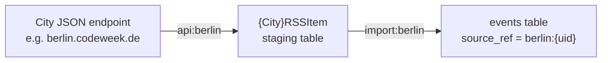

# 07 — Partner feeds and APIs

National Code Week organisations run their own registration sites. Rather than asking their organisers to register twice, we ingest their activities automatically. This chapter covers the inbound feeds, and the outbound endpoints partners consume from us.

Spreadsheet-based partner data goes through the bulk uploader instead — see [06](06-bulk-uploads-and-imports.md).

## Live inbound feeds

Four feeds run on a schedule. Everything else in this area is historical.

| Feed | Command | Frequency | Source |
|------|---------|-----------|--------|
| Germany (central) | `api:germany-central --import` | Hourly at :15 | `events.codeweek.de` |
| Germany (legacy per-city) | `api:germany` | Hourly at :10 | Per-city endpoints. **Largely a no-op** |
| eeducation.at | `import:eeducation` | Daily at 04:00 | `eeducation.at` |
| Meet and Code | `rss:meetandcode` | Hourly at :05 | `meet-and-code.org` RSS |

Plus one cleanup job:

| Command | Frequency | Purpose |
|---------|-----------|---------|
| `clean:remote` | Daily at 12:05 | Deletes previously imported activities that have disappeared from their upstream feed |

## How deduplication works

Every feed-imported activity carries two provenance columns:

| Column | Content |
|--------|---------|
| `mass_added_for` | Which mechanism created it, e.g. `API codeweek_de`, `RSS Eeducation` |
| `source_ref` | The upstream identifier, namespaced as `{feed-key}:{uid}` |

`source_ref` is what makes the imports idempotent. Running a feed twice updates rows rather than duplicating them.

The namespacing is deliberate and load-bearing. The central German export writes `codeweek-de:{uid}`, while the legacy city feeds wrote `berlin:{uid}`, `hamburg:{uid}` and so on. Because the namespaces differ, **the central import does not overwrite or collide with legacy rows**. This is called out in the scheduler:

```28:30:routes/console.php
// New central codeweek.de export (single URL). Uses source_ref "codeweek-de:{uid}"
// so it does not overwrite legacy "berlin:{uid}" / "hamburg:{uid}" events.
Schedule::command('api:germany-central --import')->hourlyAt(15);
```

A side effect worth knowing: the same real-world activity can exist twice, once from a legacy city feed and once from the central export, because the two have different `source_ref` namespaces. If Germany reports duplicates, that is the first thing to check.

---

## Germany: the central export

This is the important one and the pattern to follow for any new national partner.

**File:** [app/Console/Commands/api/GermanyCentral.php](../../app/Console/Commands/api/GermanyCentral.php)

```17:20:app/Console/Commands/api/GermanyCentral.php
    protected $signature = 'api:germany-central
                            {--url=https://events.codeweek.de/api/v1/export/ : Central DE export URL}
                            {--limit=0 : Limit number of items (0 = all)}
                            {--import : Persist events (default is dry-run only)}';
```

### It is dry-run by default

**Without `--import` the command writes nothing.** This is the single most useful property of the tool and how you should always start:

```bash
# Inspect the feed, validate every row, change nothing
php artisan api:germany-central

# Same but only the first 20 items
php artisan api:germany-central --limit=20

# Actually write
php artisan api:germany-central --import
```

The dry run reports counts of created, updated, skipped, and failed rows, plus a per-row issue list keyed by upstream `uid`. When a partner asks why some of their activities are missing, run the dry run and send them the issue list.

### Expected payload shape

A **top-level JSON array** of activity objects. The command explicitly rejects the `{"events": [...]}` wrapper with a clear error, because partners get this wrong:

```53:57:app/Console/Commands/api/GermanyCentral.php
        if (is_array($json) && isset($json['events']) && is_array($json['events']) && ! array_is_list($json)) {
            $this->error('Top-level is {"events":[...]} — importer expects a JSON array.');

            return self::FAILURE;
        }
```

Fetch settings: 90 second timeout, `Accept: application/json`, and a `codeweek-eu-germany-central/1.0` User-Agent (useful if a partner needs to allowlist us).

### Per-item validation

`validateItem()` requires, per activity:

| Field | Requirement |
|-------|-------------|
| `uid` | Present and numeric |
| `user` | An object |
| `user.email` | Non-empty |
| `user.type.identifier` | Non-empty |
| `type.identifier` | Present |
| `title`, `description`, `organizer` | Non-empty |
| `eventStartDate`, `eventEndDate` | Exactly `YYYY-MM-DD HH:MM:SS` |
| `tags` | If present, an array of objects each having a `title` |

The date format is strict — matched with a regular expression, not parsed leniently. A partner sending ISO 8601 with a `T` separator or a timezone suffix will have **every row rejected**. This is the most common integration failure.

### Mapping and ownership

`mapAttrs()` maps the payload onto `events`, covering title, slug, organiser, description, organiser type, activity type, location, URL, contact, country (defaulting to `DE`), picture, language, dates, coordinates, participant and gender counts, the boolean curriculum flags, duration, activity format, ages, leading teacher tag, and the Code Week 4 All code. Audience, theme, and tag pivots are synced on every upsert, so removing a tag upstream removes it here.

Activities are owned by a dedicated technical user resolved through `ImporterHelper::getTechnicalUser('codeweek-de-technical')`, used as a fallback when the payload's user cannot be matched. **Do not delete that account** — imported German activities hang off it.

---

## Germany: the legacy per-city pipeline

Historical, and mostly dormant. Kept scheduled so that any city still serving data continues to work.

It is a **two-stage** design, unlike the central export:



Stage one (`api:{city}`) fetches JSON and upserts staging rows via `GermanTraits::createRSSItem()`. Stage two (`import:{city}`) reads rows with a null `imported_at` and creates or updates activities through `GermanTraits::createGermanEvent()`.

`api:germany` orchestrates stage one across every city in `ImporterHelper::getGermanCities()`: `niedersachsen`, `hamburg`, `baden`, `berlin`, `bremen`, `muensterland`, `nordhessen`, `bayern`, `bonn`. Additional commands exist for `dresden`, `leipzig`, and `thueringen`.

The scheduler is honest about the state of it:

```25:26:routes/console.php
// Keep legacy per-city German feeds (no-op while they return [] / 404).
Schedule::command('api:germany')->hourlyAt(10);
```

**Do not invest in this pipeline.** If Germany needs changes, they go in the central export. The main reason to understand it at all is that historical German activities carry city-namespaced `source_ref` values, and the per-city `*_rss_items` staging tables still hold data.

---

## eeducation.at

| Item | Detail |
|------|--------|
| Command | `import:eeducation` ([app/Console/Commands/Importers/Eeducation.php](../../app/Console/Commands/Importers/Eeducation.php)) |
| Schedule | Daily at 04:00 |
| Endpoint | `https://eeducation.at/rest-api/codeweek-activities/?clientid={EEDUCATION_CLIENTID}` |
| Parser | `App\Importers\Eeducation`, driven by `app/Imports/RemoteImporter.php` |
| Provenance | `mass_added_for = 'RSS Eeducation'` |

This feed uses the **`importers` tracker table** rather than `source_ref`. Each imported activity gets a row recording `website`, `original_id`, `event_id`, and `seen_at`. `clean:remote` then deletes activities whose tracker row has not been refreshed in 24 hours — the mechanism by which an activity cancelled upstream disappears from our map.

Requires `EEDUCATION_CLIENTID` in the environment. Without it the endpoint returns nothing and the import silently does no work.

`RemoteImporter` resolves its parser dynamically from the website name to a class under `App\Importers\`, so adding a similar feed means adding a parser class there.

---

## Meet and Code

| Item | Detail |
|------|--------|
| Command | `rss:meetandcode` ([app/Console/Commands/rss/MeetAndCode.php](../../app/Console/Commands/rss/MeetAndCode.php)) |
| Schedule | Hourly at :05 |
| Feed | `https://www.meet-and-code.org/de/de/events/rss/` |
| Staging model | `App\MeetAndCodeRSSItem` |
| Disk | Generated XML written to the `meet-and-code` local disk (`public/rss/`) |

Reads the RSS with `willvincent/feeds`, stages items, then creates or updates activities.

Three follow-up commands exist for data quality on these rows, run manually:

| Command | Purpose |
|---------|---------|
| `meetandcode:users` | Links imported activities to user accounts |
| `meetandcode:languages` | Fills in activity languages |
| `meetandcode:themes` | Fills in themes and audiences |

---

## Outbound: what partners can consume from us

### Public API

Three endpoints in [routes/api.php](../../routes/api.php), handled by [app/Http/Controllers/Api/EventsController.php](../../app/Http/Controllers/Api/EventsController.php).

| Endpoint | Returns |
|----------|---------|
| `GET /api/events/geobox` | Activities within a latitude/longitude bounding box. Powers map panning. Span is capped at 10 degrees |
| `GET /api/events/germany?year={year}` | All approved German activities for a year |
| `GET /api/event-detail/{event}` | A single activity |

**These are unauthenticated.** There is no API key, no token, and no per-consumer rate limit beyond the global API throttle of 60 requests per minute configured in [bootstrap/app.php](../../bootstrap/app.php).

`/api/events/germany` is notable: it is a country-specific export endpoint with no equivalent for any other country, built for the German partner's reciprocal integration. If another national partner asks for the same thing, generalise it rather than adding a second country-specific route.

### Endpoints used by our own front end

The Vue components call `/api/*` routes defined in **`routes/web.php`**, not `routes/api.php` — `/api/event/list`, `/api/event/detail`, `/api/event/closest`, `/api/event/eeducation`, and the geocoding proxies at `/api/proxy/geocode` and `/api/proxy/suggest`. They are session-authenticated where they need to be. Worth knowing so you look in the right file.

### Internal support API

`/api/internal/support/*`, gated by the `support.service.token` middleware (a bearer token in `SUPPORT_SERVICE_TOKEN`). Covers case intake, triage, diagnostics, tool calls (user audit, user restore, profile update, event audit), and the approval workflow. Only relevant if you operate the support copilot subsystem.

### Podcast RSS

`GET /feed/podcasts`, generated by `spatie/laravel-feed` from the `Podcast` model. Configured in [config/feed.php](../../config/feed.php).

---

## Onboarding a new national partner

The path of least resistance, in order of preference:

1. **Spreadsheet through `/admin/bulk-upload`.** No code. Point them at the [public wiki guide](https://github.com/codeeu/codeweek/wiki/Publish-your-events-into-Codeweek) and the template it links. Right answer for annual or occasional deliveries.
2. **A JSON export shaped like the German one.** If they want continuous sync, ask them to match the `events.codeweek.de` payload shape. Then it is a near-copy of `GermanyCentral.php` with a new feed key, and you inherit the dry-run and validation behaviour for free.
3. **A bespoke importer.** Only if neither of the above fits. Put the parser in `app/Importers/` and drive it through `RemoteImporter` so it participates in the `importers` tracker and therefore in `clean:remote`.

Whichever route, settle these before writing code:

- **A stable unique ID per activity.** Without one, deduplication is impossible and every run creates duplicates.
- **The exact date format**, and whether times are local or UTC.
- **Who owns the imported activities** — real user accounts matched by email, or a technical user.
- **What happens when an activity is cancelled upstream.** Does it vanish from the feed (so `clean:remote` handles it) or get flagged?
- **Whether imported activities should be auto-approved.** Feed imports currently bypass moderation.

Then add the schedule entry to `routes/console.php`, and document it in [10](10-scheduled-jobs-and-runbooks.md).

## Sample payloads

`docs/internal/` holds captured samples, including a full `codeweek.de` export and an EU export sample. That directory is **gitignored**, so these files must be transferred outside git during handover. They are the quickest way to see a real payload without waiting for a live fetch.

Note that `api:germany-central --url=` expects an HTTP URL, not a local file path, so replaying a saved sample means serving it over HTTP locally.
