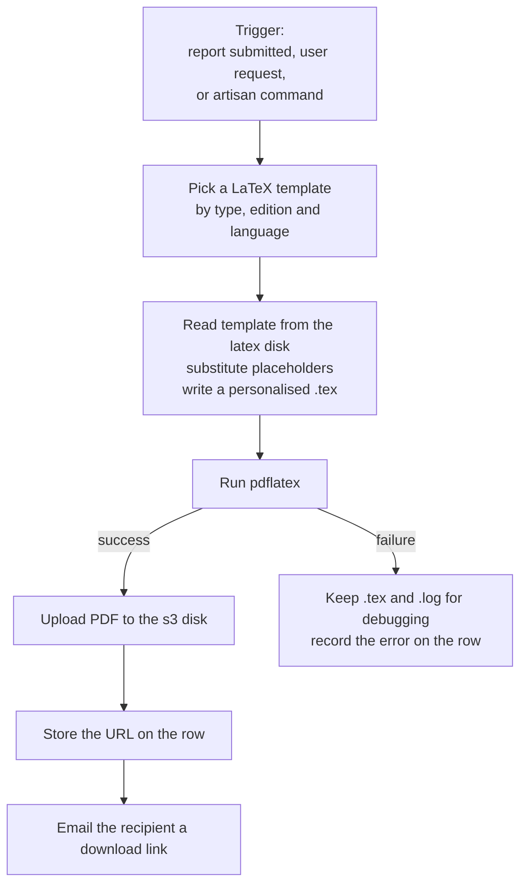

# 08 — Certificates

Certificates are the most operationally demanding part of the platform. They matter a lot to users, they are generated in bursts after October, and the pipeline depends on a system-level TeX installation that has nothing to do with PHP.

This chapter consolidates and corrects the two certificate documents we inherited (`Certificates - Technical Documentation.docx` and `Certificate Generation Process Documentation`). Where those documents referenced a developer's local absolute paths or a retired private staging host, paths here are repo-relative and URLs are public.

## The four types

| Type | Awarded to | Trigger | Data stored in |
|------|------------|---------|----------------|
| **Recognition** | The activity organiser | Organiser files a report on an approved activity | Columns on `events` |
| **Participation** | Attendees, usually a class of students | Organiser generates them in bulk on the site | `participations` table |
| **Excellence** | Code Week 4 All networks | Artisan command per edition | `excellences`, `type = 'Excellence'` |
| **Super Organiser** | Organisers running 10+ activities | Artisan command per edition | `excellences`, `type = 'SuperOrganiser'` |

Eligibility rules:

- **Excellence** — a Code Week 4 All network with 10 activities linked from 10 different organisers, or with 3 countries involved.
- **Super Organiser** — 10 or more activities in a single edition.

Remember that "edition" is just a **calendar year** ([04](04-domain-model.md)).

## How generation works



The important thing to internalise: **this shells out to `pdflatex`.** There is no PHP PDF library involved. Failures are usually TeX failures — a missing font package, an unescaped character in a user-supplied name, a missing template file — and they are diagnosed by reading a `.log` file, not a PHP stack trace.

## Code map

| Concern | File |
|---------|------|
| Recognition generation | [app/Certificate.php](../../app/Certificate.php) |
| Excellence and Super Organiser generation | [app/CertificateExcellence.php](../../app/CertificateExcellence.php) |
| Participation generation | [app/CertificateParticipation.php](../../app/CertificateParticipation.php) |
| Shared helper, ZIP packaging, S3 upload | [app/Helpers/CertificatesHelper.php](../../app/Helpers/CertificatesHelper.php) |
| Supporting classes | `app/Certificates/` |
| Controllers | `CertificateController`, `ExcellenceController`, `ParticipationController`, `AdminController`, `CertificateBackendController` |
| Batch jobs | `app/Jobs/GenerateCertificateBatchJob.php`, `SendCertificateBatchJob.php`, `GenerateCertificatesOfParticipation.php`, `MissingCertificate.php` |
| Templates | `resources/latex/` |
| Excellence model | [app/Excellence.php](../../app/Excellence.php) |

Note that `Certificate.php`, `CertificateExcellence.php`, and `CertificateParticipation.php` sit alongside the Eloquent models in `app/` but are **service classes, not models**.

## Templates

41 `.tex` files in `resources/latex/`, plus an `images/` directory for the artwork.

Naming conventions:

| Pattern | Example | Used for |
|---------|---------|----------|
| `template.tex` | | Recognition, general |
| `template_greek.tex` | | Recognition, Greek |
| `participation.tex` | | Participation, general |
| `participation_greek.tex` | | Participation, Greek |
| `participation_ukrainian.tex` | | Participation, Ukrainian |
| `participation_multilang.tex` | | Participation, multi-language |
| `excellence-{year}.tex` | `excellence-2026.tex` | Excellence, general |
| `excellence_greek-{year}.tex` | `excellence_greek-2026.tex` | Excellence, Greek |
| `super-organiser-{year}.tex` | `super-organiser-2026.tex` | Super Organiser, general |
| `super-organiser_greek-{year}.tex` | `super-organiser_greek-2026.tex` | Super Organiser, Greek |

Excellence and Super Organiser templates are **versioned per edition**: excellence templates exist for 2018 through 2026, super-organiser for 2020 through 2026. Recognition and Participation templates are **not** versioned — there is one of each, updated in place.

The template name is derived from type and edition at runtime:

```48:49:app/CertificateExcellence.php
        // e.g. "excellence-2025.tex" or "super-organiser-2025.tex"
        $this->templateName = "{$this->type}-{$this->edition}.tex";
```

with a language override:

```205:205:app/CertificateExcellence.php
            $this->templateName = "{$this->type}_greek-{$this->edition}.tex";
```

**So a missing template for the current edition is a hard failure.** Running `notify:winners 2027` without `excellence-2027.tex` present will fail for every recipient. Creating next year's templates is the first task of the annual rollover.

### Two oddities in the template directory

- **`SuperOrganiser-2024.tex` and `SuperOrganiser_greek-2024.tex`** use a different capitalisation from every other file (`super-organiser-2024.tex` also exists). On a case-sensitive filesystem these are distinct files. Do not assume they are duplicates without checking which one the code actually resolves.
- **`nH8nokEg9c-1.tex`**, along with matching `.aux` and `.log` files, is **leftover build debris** from a failed compile that got committed. It can be deleted. Note that personalised `.tex` files are written into this same directory during generation, so debris accumulating here is expected at runtime — it is only a problem when it gets committed.

## Language handling

Certificates are issued across the whole EU, and some scripts need TeX packages and encoding that the default template does not provide. The approach is **a separate template per problem script** rather than one clever template.

Greek has a dedicated variant for every type. Participation additionally has Ukrainian and multi-language variants. `CertificateParticipation` selects between them:

```103:110:app/CertificateParticipation.php
        // --- Choose base template (per detected script in any field) ---
        if ($this->is_greek_text($this->event_name) || $this->is_greek_text($this->event_date) || $this->is_greek_text($this->name_of_certificate_holder)) {
            $this->templateName = 'participation_greek.tex';
        } elseif ($this->is_ukrainian_text($this->event_name) || $this->is_ukrainian_text($this->event_date) || $this->is_ukrainian_text($this->name_of_certificate_holder)) {
            $this->templateName = 'participation_ukrainian.tex';
        } else {
            $this->templateName = 'participation.tex';
        }
```

Note that the script is **detected from the content of the recipient's name, activity name, and date** — not from a locale setting. A Greek name on an otherwise English activity gets the Greek template.

Consequences to plan for:

- Adding a language that needs special encoding means **a new template file per certificate type**, not a configuration change.
- When you refresh the design each year, **the language variants must be refreshed too** or Greek recipients get last year's artwork.
- `php artisan certificate:test-two` exists specifically to preflight names in Greek, Cyrillic, and other scripts. Use it before a big run.

## Server requirements

Certificates will not generate without TeX Live. From the original infrastructure handover:

```bash
sudo apt-get install texlive-latex-base -y
sudo apt-get install texlive-fonts-recommended -y
sudo apt-get install texlive-fonts-extra -y
sudo apt-get install texlive-lang-cyrillic -y
sudo apt-get install texlive-lang-greek -y
sudo apt-get install texlive-latex-extra -y
sudo apt-get install texlive-font-utils -y
```

`texlive-lang-cyrillic` and `texlive-lang-greek` are **required, not optional**. Also set:

| Requirement | Value |
|-------------|-------|
| `PDFLATEX_PATH` | Absolute path to the `pdflatex` binary |
| PHP memory limit | 2048 MB |

If `PDFLATEX_PATH` is empty or wrong, every certificate fails. That is the first thing to check on a new server.

## Storage

| What | Where |
|------|-------|
| Templates and intermediate `.tex` / `.log` / `.aux` | The `latex` local disk (`resources/latex/`) |
| Finished individual PDFs | The `s3` disk, at `certificates/{id}.pdf` |
| Participation ZIP bundles | The `s3` disk, at `participation/{zipname}` |

```74:75:app/Helpers/CertificatesHelper.php
            $s3Path = 'participation/' . $zipname;
            $upload = Storage::disk('s3')->put($s3Path, $zipStream);
```

On failure the `.tex` and `.log` are deliberately **left in place** so you can debug. That is your primary diagnostic artefact.

## User-facing flows

### Recognition

1. Organiser submits an activity; an ambassador approves it.
2. After the end date the organiser is prompted (and reminded by `remind:creators`, daily at 10:00) to file a report.
3. The report captures `name_for_certificate`, `participants_count`, `average_participant_age`, and `percentage_of_females`.
4. On submission the certificate generates and a download link is shown.

Filing the report sets `reported_at`, which **locks the activity against further edits** by the owner. Organisers regularly raise support tickets about this.

### Participation

Self-service at [codeweek.eu/participation](https://codeweek.eu/participation). The organiser enters the list of student names, the activity name, and the date. One PDF is generated per name and the batch is delivered as a single ZIP.

Routes: `GET`/`POST /participation` → `ParticipationController::show` and `generate`.

Rows start with `status = 'PENDING'` and move on as generation completes, or to an error state. A stuck batch is usually a missing queue worker.

### Excellence and Super Organiser

Eligible users see them at `/certificates`, with per-edition report pages:

| Route | Purpose |
|-------|---------|
| `GET /certificates` | The user's certificate list |
| `GET`/`POST /certificates/excellence/{edition}` | Excellence report and generation |
| `GET`/`POST /certificates/super-organiser/{edition}` | Super Organiser report and generation |

Access is controlled by two custom gates registered in `AppServiceProvider`: `report-excellence` and `report-super-organiser`, each checking for an `excellences` row of the right type and edition.

## The certificate backend admin

A dedicated batch operations UI at `/admin/certificate-backend/*`, handled by `CertificateBackendController`:

| Route | Purpose |
|-------|---------|
| `/` | Dashboard |
| `/list` | Recipients |
| `/status` | Progress of a running batch |
| `/generate/start`, `/generate/cancel` | Start and cancel generation |
| `/send/start` | Start sending emails |
| `/regenerate/{id}`, `/resend/{id}` | Single-recipient fixes |
| `/resend-all-failed` | Retry every failure |
| `/errors` | Failure list |
| `/manual-create-send` | Create and send one certificate by hand |

Batch progress is tracked in the cache with a 24-hour TTL.

**This area is gated on an explicit email allowlist**, not a role:

```25:29:app/Http/Middleware/EnsureSuperCertificateAdmin.php
        $email = $request->user()?->email;

        if ($email === null || ! in_array(strtolower($email), array_map('strtolower', $allowed), true)) {
            abort(403, 'Access denied. This area is restricted to the certificate administrator.');
        }
```

The list comes from `CERTIFICATE_ADMIN_EMAILS`, comma-separated, and the comparison is case-insensitive. **Being a super admin grants nothing here.** If the variable is unset the middleware denies everyone and says so in the 403, so `Set CERTIFICATE_ADMIN_EMAILS` in a browser is your diagnosis. **Set it before the first certificate run.** See [00](00-access-checklist.md) and [12](12-risks-and-known-issues.md).

## Artisan commands

### Awarding and notifying

| Command | Purpose |
|---------|---------|
| `php artisan excellence {edition}` | Tags the excellence winners for an edition |
| `php artisan superorganisers {edition}` | Allows super organisers for an edition to generate certificates |
| `php artisan notify:winners {edition}` | Identifies Excellence winners, generates certificates, emails recipients |
| `php artisan notify:superorganisers {edition}` | Same for Super Organisers |

### Batch generation and sending

| Command | Purpose |
|---------|---------|
| `certificate:generate-window` | Generates certificates in batches until none are pending |
| `certificate:send-window` | Sends certificate emails in batches |
| `certificate:clear-generation` | Clears stuck generation state |
| `certificate:preflight` | **Dry-run compiles and reports failures without sending anything** |
| `certificate:test-two` | Preflights awkward names (Greek, Cyrillic, and similar) |

### Diagnosis and repair

| Command | Purpose |
|---------|---------|
| `certificate:stats` | Counts by state |
| `certificate:issues` | Finds certificates with generation problems. **Scheduled hourly at :33** |
| `certificate:failures-report` | Lists or exports failures |
| `certificate:retry-failed` | Resets failed rows for another attempt |
| `certificate:regenerate-in-place` | Regenerates a single PDF, keeping the URL |
| `certificate:reassign-user` | Moves certificate rows between users |
| `certificate:fill-empty-names` | Fills blank `name_for_certificate` on Excellence rows |
| `certificate:orphaned-excellence` | Finds and fixes Excellence rows whose user is gone |
| `certificate:regenerate-greek-super-organiser` | Targeted fix for Greek Super Organiser PDFs |
| `certificates:fix` | Generates missing participation certificates |
| `missing:certificates` | Generates missing certificates |
| `cw:export-certificates-proof` | CSV manifest of everything issued, to `storage/app/exports/` |
| `support:certificate-kpi-report` | KPI counts for reporting |

`certificates:fix` is **commented out** in the scheduler:

```40:40:routes/console.php
//Schedule::command('certificates:fix')->everyFiveMinutes();
```

Leave it that way unless you know why it was disabled — running a generation command every five minutes will queue work faster than TeX can complete it.

The number of repair commands here is itself a signal: this pipeline fails often enough that a substantial toolkit grew around it. Expect to use them.

## Error tracking

The `excellences` table carries `certificate_generation_error` and `certificate_sent_error` (added 2025). When a run goes wrong, query those columns first, then look at the `.log` file left behind on the `latex` disk.

## The annual rollover

Do this at the start of each edition, before any generation runs.

1. **Create the new templates.** Copy the previous year's and apply the new design:
   - `excellence-{year}.tex`
   - `excellence_greek-{year}.tex`
   - `super-organiser-{year}.tex`
   - `super-organiser_greek-{year}.tex`
2. **Refresh the non-versioned templates** in place for the new design: `template.tex`, `template_greek.tex`, `participation.tex`, `participation_greek.tex`, `participation_ukrainian.tex`, `participation_multilang.tex`.
3. **Update the artwork** in `resources/latex/images/`.
4. **Deploy.**
5. **Restart the PHP workers** — see the warning below. `php artisan queue:restart`.
6. **Preflight** with `php artisan certificate:preflight` and `php artisan certificate:test-two`.
7. **Generate and notify** with `notify:winners {edition}` and `notify:superorganisers {edition}`.
8. **Check for failures** with `certificate:failures-report`, and retry with `certificate:retry-failed`.

### The worker restart gotcha

This is the single most valuable piece of institutional knowledge in the inherited documentation, so it is repeated here:

> After updating the LaTeX templates, you **must** restart the PHP workers before running the certificate commands. Long-running workers hold the previous templates in memory. Skip the restart and certificates are generated **silently using last year's design** — no error, no warning, just wrong output that has already been emailed to recipients.

`php artisan queue:restart` is in the deploy script for exactly this reason ([02](02-environments-and-deployment.md)). Verify it actually ran.

### Test with a real name before the bulk run

Before generating thousands, generate one for a recipient whose name contains characters likely to break TeX — Greek, Cyrillic, or an accented Latin name. `certificate:test-two` is built for this. A run that fails at recipient 400 of 2,000 leaves you reconciling which half went out.
