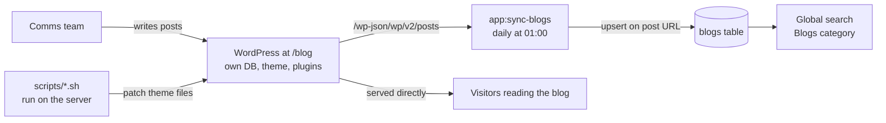

# 09 — The WordPress blog

## What it is

[codeweek.eu/blog](https://codeweek.eu/blog/) is **a separate WordPress application**, not part of the Laravel codebase. It shares the `codeweek.eu` domain but is a distinct install with its own admin, database, theme, and plugins.

It is where the communications team publishes news, ambassador profiles, activity highlights, and campaign announcements. It is not in this repository, and nothing in the Laravel deploy touches it.



Two entirely separate things are going on, and conflating them causes confusion:

1. **Visitors read the blog from WordPress directly.** Laravel does not render blog posts.
2. **Laravel keeps a read-only mirror** of post metadata in its own `blogs` table, purely so blog posts appear in site-wide search.

## The sync

**Command:** `php artisan app:sync-blogs` — [app/Console/Commands/SyncBlogs.php](../../app/Console/Commands/SyncBlogs.php)
**Schedule:** daily at 01:00, in [routes/console.php](../../routes/console.php)

It walks the WordPress REST API, ten posts at a time, until it runs out of pages:

```31:37:app/Console/Commands/SyncBlogs.php
        $url = config('codeweek.blog_url') . '/wp-json/wp/v2/posts';
        $perPage = 10;
        $page = 1;

        try {
            do {
                $response = Http::get("{$url}?per_page={$perPage}&page={$page}");
```

Pagination is driven by the `X-WP-TotalPages` response header. Each post is upserted into `blogs` **keyed on the post's URL** (`path`):

| `blogs` column | Source in the WordPress payload |
|----------------|---------------------------------|
| `name` | `title.rendered` |
| `description` | `excerpt.rendered`, with tags stripped |
| `content` | `content.rendered` |
| `categories`, `tags` | The ID arrays, JSON-encoded |
| `thumbnail` | Resolved via a second request — see below |
| `path` | `link` (the match key) |
| `date`, `modified`, `status`, `type`, `slug` | Direct copies |

Thumbnails need an **extra HTTP request per post**. The posts response only carries a `_links.wp:featuredmedia` href, so `fetchThumbnail()` fetches that and reads `source_url`. With a few hundred posts that is a few hundred extra requests per run — which is why this is a nightly job and not something you want to trigger casually in a loop.

The `Blog` model is deliberately thin: `public $timestamps = false`, everything fillable, no relationships. It is a mirror, not a domain object.

### What the mirror is used for

Exactly one thing: **global search**. `app/Enums/GlobalSearchFiltersEnum.php` registers a `Blogs` category that queries the `blogs` table and renders results as **external links** back to WordPress.

```107:115:app/Enums/GlobalSearchFiltersEnum.php
            self::BLOGS => [
                'model' => Blog::class,
                'map_fields' => [
                    'name' => '{name}',
                    'category' => 'Blog',
                    'description' => '{description}',
                    'thumbnail' => '{thumbnail}',
                    'path' => '{path}',
                    'link_type' => 'external',
```

So a blog post that does not show up in site search is almost always a sync problem, not a search problem.

### Failure modes

The command is resilient but quiet about it, which is the main operational risk:

| Situation | Behaviour |
|-----------|-----------|
| A page request fails | Prints an error and **breaks the loop** — later pages are not synced at all |
| A thumbnail fetch fails | Logs and returns null; the post still syncs, without an image |
| Any exception | Logged to `Log::error` and the command exits cleanly |

**Deletions are never propagated.** Because it only ever upserts, a post deleted or unpublished in WordPress stays in the `blogs` table forever and keeps appearing in search, linking to a 404. There is no reconciliation pass. If someone reports a dead search result pointing at the blog, this is why, and the fix is to delete the row manually.

Nothing alerts on a failed sync. If search results go stale, check the scheduler ran and look for `Error syncing blogs` in the logs.

### The `BLOG_URL` trap on non-production environments

```15:15:config/codeweek.php
    'blog_url' => env('BLOG_URL', 'https://codeweek.eu/blog'),
```

The default is the **live** blog. On dev or local, unless `BLOG_URL` is set explicitly, `app:sync-blogs` pulls production content into that environment's database. Harmless for a read-only fetch, but it means dev search results silently reflect live content, and it puts load on the production blog from non-production environments.

### Running it manually

```bash
php artisan app:sync-blogs
```

Safe to run any time — it is idempotent, upserting on the post URL. It prints one line per page. The slow part is the per-post thumbnail lookups.

## Theme patching

This is the part that will surprise you. There are **18 shell scripts in [scripts/](../../scripts)** that modify the live WordPress theme's files on the server.

| Group | Scripts |
|-------|---------|
| Mobile menu | `fix-blog-mobile-menu-clickability.sh`, `-js-syntax`, `-laravel-match`, `-snappy`, `-v2`, `patch-blog-mobile-menu-parent-links.sh` |
| Hero and CTA | `fix-blog-hero-cta-render.sh`, `patch-blog-hero-cta-and-menu-icon.sh`, `patch-blog-hero-height.sh` |
| Chevron and buttons | `fix-blog-chevron-and-button.sh`, `-and-hero-cta`, `-left-cta`, `-position-remove-arrow` |
| Footer | `fix-blog-footer-js-stray-brace.sh`, `fix-blog-footer-script-clean.sh` |
| Feature deploy | `deploy-blog-share-stories.sh`, `patch-blog-menu-share-stories-icon.sh` |

They share a pattern: locate the WordPress root and the theme directory, then rewrite `new.css`, `header.php`, `header-v2.php`, and `footer.php` in place using embedded Python, and cache-bust the CSS with a timestamp.

```5:11:scripts/fix-blog-mobile-menu-v2.sh
WP_ROOT="${WP_ROOT:-/var/www/html/blog}"
THEME="${THEME:-$WP_ROOT/wp-content/themes/eucodewe-1389}"
CACHE_VER="${CACHE_VER:-$(date +%Y%m%d%H%M)}"

[[ -d "$WP_ROOT" ]] || { echo "WP_ROOT not found"; exit 1; }
[[ -f "$THEME/new.css" ]] || { echo "Theme new.css not found"; exit 1; }
command -v wp >/dev/null 2>&1 || { echo "wp-cli required"; exit 1; }
```

Both `WP_ROOT` and `THEME` are overridable environment variables. `wp-cli` must be installed on the server. Some scripts fall back to searching under `/var/www` for the theme directory if the default path misses.

### Why this matters

The consequences of this arrangement are significant, so be explicit about them:

- **The blog theme's real state exists only on the server.** The scripts are patches against whatever the theme happened to look like at the time. They are not a source of truth, and running them out of order or against an updated theme may not apply.
- **A WordPress theme update can silently undo all of it.** Every one of these fixes lives in theme files that an update overwrites. If the mobile menu, hero, or footer suddenly regresses after a WordPress maintenance window, an update reverted the patches.
- **They are not idempotent in any guaranteed way.** Several insert CSS blocks keyed on a marker comment, so a second run may be a no-op or may duplicate, depending on the script.
- **They run as root on the live server.** There is no dry-run mode and no rollback.

### Guidance

Before running any of them:

1. **Back up the theme directory.** `tar` it up first. There is no undo.
2. Read the script. They are short, and the embedded Python shows exactly what will be rewritten.
3. Prefer the highest-numbered or most recent variant where several address the same thing (for example `fix-blog-mobile-menu-v2.sh` over the earlier mobile menu scripts).
4. Verify on the live blog immediately afterwards, on both desktop and mobile, since most of these are mobile-specific.

**The better long-term fix** is to move these changes into a proper child theme kept in version control, so a WordPress update cannot revert them and the current state is reviewable. Until that happens, treat this directory as a set of emergency patches with institutional knowledge attached, and keep a note of which were last applied.

## Redirects

`routes/web.php` contains a long list of `Route::permanentRedirect()` entries mapping old top-level URLs to `/blog/...` paths — the residue of a content migration when posts moved under the blog. Keep them; they are load-bearing for SEO and for links in old newsletters and press coverage.

## Handover items

- WordPress admin credentials, and confirmation of who else has accounts.
- Filesystem and `wp-cli` access to the blog directory on the live server.
- A backup of the current theme, since the patched state is not in version control.
- The WordPress and plugin update policy — updates are what revert the theme patches.
- Confirmation that the blog has its own backup schedule. It is a separate application, so a Laravel database backup does not cover it.
