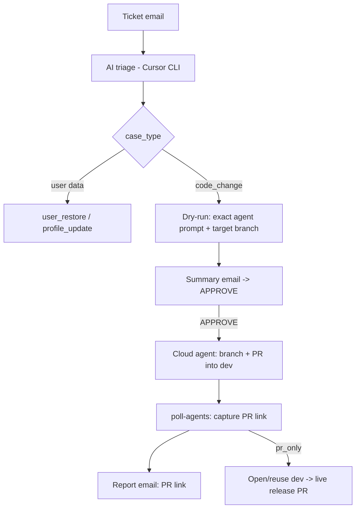

# CodeWeek Support Copilot — AI capabilities (Phase 1)

**Status:** Phase 1 · AI triage + frontend code fixes as PRs into `dev`
**Phase 2:** AI-driven `artisan` changes on the server (allowlist-first, dry-run + APPROVE)
**Phase 3:** AI content/copy edits on Nova-managed records (text fields only, dry-run + APPROVE)

This builds on the email pipeline in [support-copilot-stakeholder-guide.md](./support-copilot-stakeholder-guide.md)
and the action matrix in [support-copilot-allowed-actions.md](./support-copilot-allowed-actions.md).

---

## What changed

| Before | Now (Phase 1) |
|--------|----------------|
| Deterministic keyword triage | **AI triage** via the Cursor headless CLI, with the keyword rules as automatic fallback |
| Only user data actions (`user_restore`, `user_profile_update`) | Adds **`code_change`**: a frontend/code fix implemented by a Cursor cloud agent as a **PR into `dev`** |
| — | Optional **dev → live release PR** opened for a human to merge (never auto-merged) |

The safety model is unchanged: in dry-run mode every write (including `code_change`)
sends a summary and only runs after an emailed **APPROVE** from an allowed domain.

---

## One key, two Cursor surfaces

A single `CURSOR_API_KEY` (a Cursor **service account** key is recommended) powers both:

| Surface | Used for | How |
|---------|----------|-----|
| Cursor **headless CLI** (`agent -p --output-format json`) | The triage "brain" | Runs on the Forge server |
| Cursor **Cloud Agents API** (`POST https://api.cursor.com/v1/agents`) | Code change + PR into `dev` | Runs in Cursor's cloud against the connected GitHub repo |

Prerequisites:

- Install the CLI on the server: `curl https://cursor.com/install -fsS | bash`
- Connect `github.com/codeeu/codeweek` to Cursor (Cloud Agents need GitHub access)
- Set the env vars below in Forge

---

## Flow



1. **Triage** — the CLI returns a JSON classification. If AI is disabled or fails, the keyword rules run instead.
2. **Dry-run** — for `code_change` the summary email shows the **exact instruction** the agent will receive and the target branch (`dev`). Nothing runs yet.
3. **APPROVE** — reply `APPROVE` in-thread (same rules as all other actions).
4. **Execute** — a Cursor cloud agent makes the change on a `cursor/...` branch and opens a **PR into `dev`**.
5. **Report** — `support:ai:poll-agents` (scheduled every minute) captures the PR link and emails it, and — when `SUPPORT_AI_LIVE_PROMOTION=pr_only` — opens/reuses a **dev → live** release PR for a developer to merge.

**Nothing is ever merged or deployed automatically.**

---

## Configuration (`config/support_ai.php`)

| Env var | Default | Purpose |
|---------|---------|---------|
| `SUPPORT_AI_ENABLED` | `false` | Master switch for all AI features |
| `CURSOR_API_KEY` | — | Cursor service-account key (CLI + Cloud API) |
| `SUPPORT_AI_TRIAGE_ENABLED` | `true` | Use AI triage (falls back to keywords) |
| `SUPPORT_AI_CLI_BIN` | `agent` | Path to the Cursor CLI binary |
| `SUPPORT_AI_CLI_MODEL` | `gpt-5.4-mini-medium` | Model for triage (any id from `agent models`) |
| `SUPPORT_AI_CODE_CHANGE_ENABLED` | `false` | Enable the `code_change` action |
| `SUPPORT_AI_REPO_URL` | `https://github.com/codeeu/codeweek` | Repo for cloud agents |
| `SUPPORT_AI_DEV_BRANCH` | `dev` | PR target branch |
| `SUPPORT_AI_CLOUD_MODEL` | `composer-2.5` | Model for the cloud coding agent (verify via `GET /v1/models`) |
| `SUPPORT_AI_AUTO_CREATE_PR` | `true` | Agent opens the PR on completion |
| `SUPPORT_AI_MAX_POLL_MINUTES` | `30` | Give up polling an agent after N minutes |
| `SUPPORT_AI_LIVE_PROMOTION` | `pr_only` | `pr_only` opens dev→live PR; `none` disables |
| `SUPPORT_AI_LIVE_BRANCH` | `master` | Live branch (Forge auto-deploys this) |
| `SUPPORT_GITHUB_REPO` | `codeeu/codeweek` | owner/repo for the promotion PR |
| `SUPPORT_GITHUB_TOKEN` | — | Token to open the dev→live PR (skipped if absent) |

---

## Commands

| Command | Purpose |
|---------|---------|
| `php artisan support:ai:setup-check` | Verify the Cursor key, CLI binary path, model availability, DB columns, and GitHub token |
| `php artisan support:ai:poll-agents` | Check in-flight code-change agents, capture PR links, report, open dev→live PR (scheduled every minute when enabled) |
| `php artisan support:ai:promote-dev-to-live` | Manually open/reuse the dev → live release PR |

---

## Rollout checklist

0. Run `php artisan support:ai:setup-check` and fix any warnings before enabling.
1. `SUPPORT_AI_ENABLED=true`, set `CURSOR_API_KEY`, keep `SUPPORT_AI_CODE_CHANGE_ENABLED=false` → validate AI triage only.
2. Install Cursor CLI on the server; confirm `CURSOR_API_KEY=... agent -p --force "hello"` works (the `--force` flag skips the Workspace Trust prompt — the bot passes it automatically).
3. Connect the GitHub repo to Cursor, then `SUPPORT_AI_CODE_CHANGE_ENABLED=true` → first `code_change` ticket, verify the dry-run email shows the exact prompt.
4. APPROVE once; confirm a PR opens into `dev` and the report email arrives with the link.
5. Set `SUPPORT_GITHUB_TOKEN` to enable the dev→live release PR.

Keep `SUPPORT_GMAIL_DRY_RUN=true` throughout so every change still needs an emailed APPROVE.

---

## Phase 2 — AI `artisan` changes over SSH

When triage classifies a ticket as `artisan_command`, the bot prepares a server
maintenance command and runs it through the same dry-run → APPROVE → execute →
report pipeline as every other write action. **Disabled by default**
(`SUPPORT_AI_ARTISAN_ENABLED=false`).

- **Allowlist-first** (`App\Services\Support\Artisan\ArtisanActionRegistry`): the AI may
  only pick a permitted command, and every argument/option is validated by type
  (email, token, name). Current allowlist: `support:user-audit`, `support:event-audit`,
  `support:user-restore`, `support:user-update-profile`.
- **Guarded raw fallback** (`SUPPORT_AI_ARTISAN_ALLOW_RAW=true`): if no allowlisted command
  fits, the AI may propose a bare `artisan` command. It is rejected if it contains shell
  metacharacters or hits the deny-list (`migrate:fresh`, `db:wipe`, `tinker`, `down`, …),
  treated as a write, and **never auto-simulated** — the exact command is emailed for APPROVE.
- **Execution safety:** commands run via the `Process` array form (`php artisan …`), so
  argument values can never be interpreted by a shell. Write commands that support
  `--dry-run` are previewed with it during diagnostics; read-only commands are run as-is.
  Re-validated against the allowlist/deny-list again at execution time (not trusting the
  stored approval payload). Output is captured and truncated to `SUPPORT_AI_ARTISAN_OUTPUT_LIMIT`.
- **Report:** the completion email shows the exact command and its output.

### Phase 2 env

```dotenv
SUPPORT_AI_ARTISAN_ENABLED=false      # master switch for artisan actions
SUPPORT_AI_ARTISAN_ALLOW_RAW=true     # allow AI-proposed (non-allowlisted) commands
SUPPORT_AI_ARTISAN_TIMEOUT=120        # per-command timeout (seconds)
SUPPORT_AI_ARTISAN_OUTPUT_LIMIT=8000  # captured output cap (characters)
```

`artisan_command` must also be present in `support_gmail.allowed_write_actions`
(it is by default) and `support:ai:setup-check` verifies this.

---

## Phase 3 — AI content edits on Nova-managed records

When triage classifies a ticket as `content_update`, the bot proposes an editorial
text change to an allowlisted content record and runs it through the same dry-run →
APPROVE → execute → report pipeline. The records are Nova resources, so a reviewer
can also adjust them by hand. **Disabled by default** (`SUPPORT_AI_CONTENT_ENABLED=false`).

- **Model allowlist** (`App\Services\Support\Content\ContentActionRegistry`): the AI may
  only edit listed content models (pages, homepage slides, FAQ items, menus, events,
  podcasts, partners, …). Page-style singletons are looked up automatically; other
  records are referenced by id or a unique field.
- **Text fields only** (`ContentFieldResolver`): editable columns are resolved at runtime
  to string/text columns **minus** a structural deny-list (URLs, slugs, flags, relations,
  identifiers, SEO/keyword/category fields) and minus any non-string cast (boolean / array
  / date / int). No hand-maintained per-model column list.
- **Value guards** (`ContentUpdateService::validateValue`): each new value must be plain
  text — URLs, `www.` references, and HTML/markup are rejected, length is capped at
  `SUPPORT_AI_CONTENT_MAX_FIELD_LENGTH`. Fields whose current value is a Laravel
  translation key (e.g. `hackathons.hero.title`) are left untouched.
- **Exact diff + re-validation:** diagnostics computes a before→after diff (shown in the
  approval email); execution re-runs the full plan/validation before saving — it never
  trusts the stored payload. The completion email shows the applied before→after.

### Phase 3 env

```dotenv
SUPPORT_AI_CONTENT_ENABLED=false        # master switch for content edits
SUPPORT_AI_CONTENT_MAX_FIELD_LENGTH=5000
```

`content_update` must also be present in `support_gmail.allowed_write_actions`
(it is by default) and `support:ai:setup-check` verifies this.
